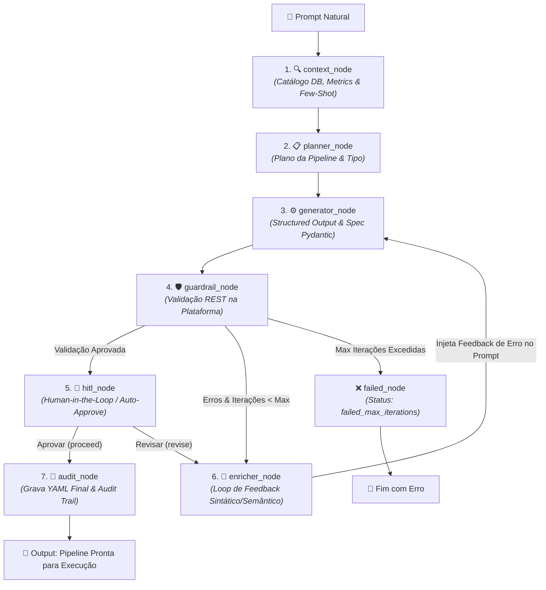

# Airflow Modern Data Platform — Architectural Showcase


Este repositório é um **projeto pessoal focado no design de arquitetura de plataformas de dados modernas**. O objetivo principal não é o tuning de performance em escala extrema, mas sim a criação de uma estrutura conceitual, genérica e altamente desacoplada, utilizando **Domain-Driven Design (DDD)** e **Clean Architecture**.

A plataforma foi projetada para ser flexível e evolutiva, permitindo a fácil substituição e adição de novas ferramentas e regras de negócio sem alterar o núcleo do domínio.

### 🤖 Desenvolvimento Assistido por IA (Spec-Driven Development)
Todo o software foi concebido e codificado utilizando a metodologia de **Spec-Driven Development (SDD)**, com uma abordagem baseada em agentes e automação de workflow. A construção foi orquestrada por meio de ferramentas especializadas como o ecossistema [Superpowers](https://github.com/obra/superpowers/tree/main) (para isolamento de tarefas técnicas de TDD e debugging), o [Strategist Skill](https://github.com/SergioLacerda/strategist-skill/) e o [SDD Harness](https://sergiolacerda.github.io/sdd-harness/).

Uma das grandes lições deste projeto é que **o design estrutural e a clareza do código são infinitamente mais importantes do que o poder ou o preço da LLM utilizada**. Nesse projeto utilizei o ecossistema Gemini (1.5 Flash / 2.5 Pro) e assistentes como Claude e ChatGPT para suporte a conceitos e correções no julgamento. Mesmo sem usar as IAs mais caras do mercado para a escrita direta de código, o foco estrito em seguir boas práticas clássicas de engenharia de software (*Clean Code*, *Clean Architecture* e *DDD*) foi o fator chave que permitiu à plataforma ser altamente flexível e evolutiva.

---

## 🏗️ Visão Geral da Arquitetura & Modularidade

A plataforma resolve o acoplamento excessivo que costuma ocorrer em ambientes de engenharia de dados ao isolar a lógica de negócio do orquestrador (Apache Airflow 3). O design segue a separação em camadas:

1.  **Domain (`app/domain`)**: O coração da plataforma, contendo entidades puras (`Pipeline`, `DataAsset`, `PipelineRun`) e Value Objects sem nenhuma dependência de frameworks.
2.  **Application (`app/application`)**: Casos de uso (`RegisterPipeline`, `RunDiscovery`) e definições de portas (`UnitOfWork`, `SecretManagerPort`) expressas como `Protocols` Python.
3.  **Infrastructure (`app/infrastructure`)**: Adaptadores que implementam os protocolos (SQLAlchemy Repositories, OpenBao/Vault Client, DuckDB Local Compute Engine).

### Capacidade de Evolução
*   **Secret Management:** A resolução de credenciais é feita via `SecretManagerPort`. O projeto implementa um adaptador para o **OpenBao (Vault)**, mas pode facilmente plugar serviços como AWS Secrets Manager ou Google Secret Manager.
*   **Metadata Discovery:** Mapeamento automático de schemas. Implementado para Bancos Relacionais (`database`), Bancos NoSQL (**MongoDB** via driver assíncrono `motor`), **APIs REST** (via OpenAPI specification parsing) e **Sistema de Arquivos** (`file_system` com inferência amostral em memória via DuckDB).
*   **Compute Engines (Ingestão de Arquivos, APIs e Bancos):** Através do `ComputeJobAdapter`, a execução física é totalmente desacoplada:
    *   **OmniBeam (`omnibeam`):** Motor proprietário em Go + Apache Beam para extração, parsing e conversão concorrente de arquivos brutos (JSON, CSV, NDJSON) para Parquet com injeção automática de metadados de auditoria (`_ingested_at`, `_source_file`) e controle de idempotência por hash MD5 (`PipelineRunFile`).
    *   **dbt Core (`dbt`):** Motor de transformação SQL modular para materialização em camadas **Medallion (Bronze ➔ Staging ➔ Silver ➔ Gold)**, modelagem dimensional Kimball (`dim_*`, `fct_*`) e detecção analítica de sinais de fraude (`gold_fraud_alerts`).
    *   **DuckDB (`duckdb`):** Motor embutido de alta velocidade para cargas locais e processamento analítico em memória.
    *   **REST API (`rest_api`):** Ingestão paralela com paginação assíncrona (`page_number`, `offset_limit`, `cursor`).
*   **DWH Loading (Carga em Data Warehouses):** Padrão **Write-Audit-Publish** com adaptadores desacoplados (`DwhLoaderPort`) para carregar arquivos estruturados (Parquet/Avro) gerados pelo Compute Engine para destinos analíticos modernos (Google Cloud BigQuery, Databricks, Snowflake).
*   **Orquestração Reativa com Airflow 3 Assets:** Encadeamento baseado em eventos e linhagem de dados orientada a ativos (`platform://asset/...`), permitindo que a finalização de uma ingestão Bronze dispare em cascata o pipeline Silver de limpeza/deduplicação e o pipeline Gold analítico.

---

## 📖 Central de Documentação do Projeto

Para entender as especificações detalhadas do projeto, navegue pelas documentações técnicas oficiais na pasta `docs/`:

### 🚀 Visão & Governança
*   **[Visão da Plataforma (docs/vision.md)](docs/vision.md):** O problema de negócio resolvido, objetivos e escopo do projeto.
*   **[Ciclo de Vida de Ingestão e Qualidade (docs/asset_lifecycle.md)](docs/asset_lifecycle.md):** Regras de qualidade (quality gates), estados operacionais de runs e ciclo de feedback com o Airflow.
*   **[Stakeholders e Governança de Acesso (docs/stakeholders.md)](docs/stakeholders.md):** Matriz de permissões por perfil (PO/PM, SRE, Analytics Engineer) e governança de ativação.

### 🏗️ Arquitetura & Engenharia
*   **[Regras de Negócio e Fluxos (docs/business_rules.md)](docs/business_rules.md):** Modela conceitualmente a separação entre `DataAsset` (lógico) e `Endpoint` (conectividade física via Vault/OpenBao), detalhando também os fluxos core (descoberta de metadados, pipelines, quality gates e linhagem).
*   **Modelagem C4 ([Contexto](docs/c4_model/context.md) / [Containers](docs/c4_model/containers.md)):** Diagramas C4 de contexto e containers de infraestrutura.
*   **[Guia de Clean Code & DDD (docs/clean-code.md)](docs/clean-code.md):** Normas de código limpo, camadas do hexágono, uso de Value Objects e TDD.
*   **[Decisões de Arquitetura - ADR Index (docs/adr/README.md)](docs/adr/README.md):** Registro formal de decisões arquiteturais (ADRs).

### ⚙️ Operação & DevOps
*   **[Guia de Operações Local (docs/operations_guide.md)](docs/operations_guide.md):** Bootstrap do cluster local via Docker Compose, uso do banco `platform_db`, comandos de CLI e API.
*   **[Perfis de Executor do Airflow (docs/operations/executor-profiles.md)](docs/operations/executor-profiles.md):** Perfis de execução (LocalExecutor vs. CeleryExecutor vs. KubernetesExecutor).
*   **[Guia de Automação de CI/CD (docs/ci_cd_guide.md)](docs/ci_cd_guide.md):** Funcionamento do pipeline de integração contínua (Ruff, Mypy) e compilação/sincronização de DAGs.

---

## 🧪 Cobertura de Testes e Validação de Integrações

O projeto é guiado por testes rigorosos que garantem o correto funcionamento dos fluxos sem acoplamento operacional:

*   **Testes de Unidade (`tests/unit`):** Testam a lógica pura de domínio e casos de uso isolados de I/O por meio de stashes/mocks nomeados de banco e segurança.
*   **Testes de Integração (`tests/integration`):** Validam persistência contra banco real/PostgreSQL e geração de código.
*   **Testes E2E (`tests/e2e`):** Rodam no ambiente Docker Compose e garantem o funcionamento integrado de:
    *   Resolução segura de segredos em tempo de execução via **OpenBao (Vault)**.
    *   Conexão física e mapeamento automático via **Discovery Runner** (Database).
    *   Disparos de ingestão assíncrona pelo **DuckDbComputeAdapter** que lê tabelas PostgreSQL e exporta arquivos Parquet consolidados e estruturados junto com arquivos de metadados (`metrics.json` e `schema.json`).


## 🛠️ Iniciando o Ambiente

Suba todo o ecossistema local com um único comando:

1.  **Configurar variáveis de ambiente:**
    ```bash
    cp .env.example .env
    # Edite .env se desejar alterar segredos ou conectar ao BigQuery real
    ```
2.  **Inicializar ambiente:**
    ```bash
    docker compose up -d --build
    ```
3.  **Acessar ferramentas:**
    -   **Airflow UI:** `http://localhost:8080` (admin/admin)
    -   **Documentação Swagger (API):** `http://localhost:8000/docs`
    -   **OpenBao (Vault):** `http://localhost:8200` (token configurado via `PLATFORM_VAULT_TOKEN` no `.env`)

4.  **Executar os testes:**
    -   Apenas Testes Unitários/Integração (independentes de Docker):
        ```bash
        uv run pytest -m "not e2e" -v
        ```
    -   Testes E2E Completos (dentro da rede Docker Compose):
        ```bash
        docker compose run --rm e2e-tests
        ```

---

## 🤝 Contribuindo

Para contribuir com a plataforma:
1. Siga as orientações em [AGENTS.md](AGENTS.md) e [docs/clean-code.md](docs/clean-code.md).
2. Instale os ganchos do pre-commit (`uv run pre-commit install`).
3. Adote mensagens de commit padronizadas (`feat:`, `fix:`, `refactor:`, `docs:`, `test:`).

---
## 📸 Evidências Visuais e Demonstração da Plataforma

Confira abaixo as telas de demonstração do funcionamento integrado da plataforma:

### 1. Documentação Interativa da API (Swagger / OpenAPI)

*Interface FastAPI para cadastro de DataAssets, Endpoints, execução de Metadata Discovery e provisionamento de Pipelines.*

### 2. Orquestração e DAGs Geradas (Apache Airflow 3)

*DAGs de Ingestão geradas dinamicamente via templates Jinja, integradas ao Task SDK do Airflow 3.*

### 3. Carga e Estruturação no Data Warehouse (Google BigQuery)

*Provisionamento automático de Datasets e Tabelas no BigQuery com dados carregados via padrão Write-Audit-Publish.*

## 🧠 Harness & AI Engineering: Geração Determinística via LangGraph

Para garantir que a geração de pipelines a partir de prompts em linguagem natural seja **determinística** e produza **especificações YAML 100% válidas e compatíveis** com a plataforma, o ecossistema utiliza um motor autônomo baseado em **LangGraph**, **Clean Architecture (Ports & Adapters)** e **Guardrails Externe-in-the-Loop**.

---

### 🔄 Fluxo de Orquestração do Grafo de Estados (`LangGraph`)



---

### 🛠️ Papel dos Nós no Grafo & Engenharia de Guardrails

1. **`context_node` (Enriquecimento Contextual):** Consulta o catálogo de metadados da plataforma (`DbSchemaReader`), leitor de volumetria histórica (`StorageMetricsReader`), JSON Schemas dinâmicos e exemplos de padrão *gold* via HTTP (`HttpPlatformReader`) para mapear tabelas, colunas, chaves primárias e *policy_tags* (PII/Restrito).
2. **`planner_node` (Planejamento Estruturado):** Decompõe a intenção do usuário em um plano de execução (`PipelinePlan`), definindo o tipo de pipeline (`ingestion`, `etl`, `export`) e estratégia de carga.
3. **`generator_node` (Geração com Coerção):** Executa o LLM utilizando **Structured Output (Pydantic)** para instanciar a especificação declarativa (`PipelineSpec`), contando com mecanismos de *fallback* determinísticos (ex: higienização e geração automática de `pipeline_id`).
4. **`guardrail_node` (Validação Externa Determinística):** Submete o YAML gerado diretamente para o endpoint de validação da Plataforma (`POST /v1/harness/validate`), garantindo validação em tempo real contra esquemas e contratos reais de execução.
5. **`enricher_node` (Loop de Feedback Sintático/Semântico):** Em caso de falhas apontadas pela plataforma, traduz as mensagens de erro em um contexto de *feedback* estruturado, alimentando o `generator_node` para autocorreção autônoma.
6. **`hitl_node` (Human-in-the-Loop):** Ponto de controle que permite aprovação humana interativa no terminal ou aprovação programática (*auto-approve*).
7. **`audit_node` (Auditoria & Persistência):** Grava a especificação YAML final válida em disco e exporta o histórico de auditoria (`AuditTrail` em JSON), registrando todas as iterações e validações do ciclo de vida.


---
## 🔐 Autenticação GCP & BigQuery

O ambiente suporta integração com Google BigQuery sem necessidade de credenciais ou arquivos JSON de service accounts versionados no repositório:

1. **Autenticação Padrão (Recomendado para Dev Local):**
   Execute o comando de Application Default Credentials (ADC):
   ```bash
   gcloud auth application-default login
   ```
2. **Uso de Chave de Service Account (opcional):**
   Se utilizar um arquivo `.json` de Service Account localmente, armazene-o **obrigatoriamente fora do repositório** e configure a variável de ambiente no arquivo `.env` (gitignored):
   ```bash
   GOOGLE_APPLICATION_CREDENTIALS=/caminho/fora/do/repo/sua-chave.json
   PLATFORM_GCP_PROJECT=seu-gcp-project-id
   PLATFORM_DWH_PROVISIONER_ADAPTER=bigquery
   ```
