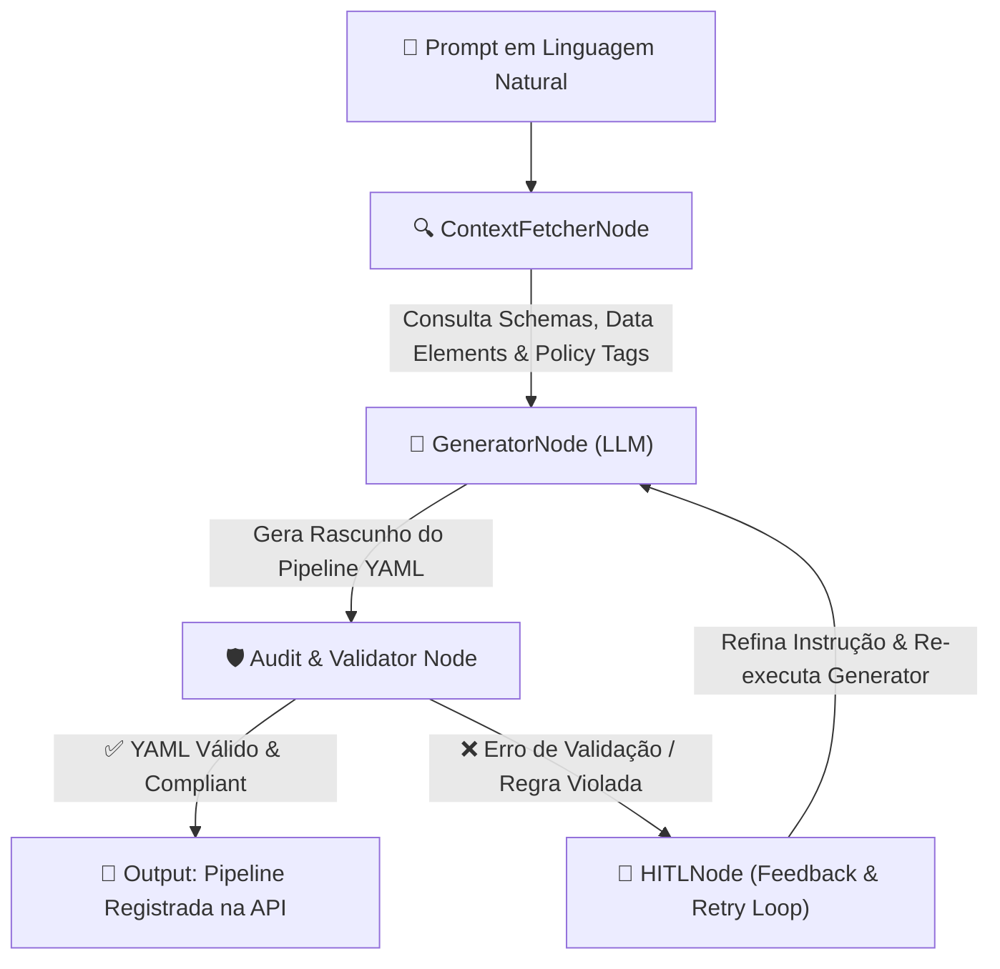
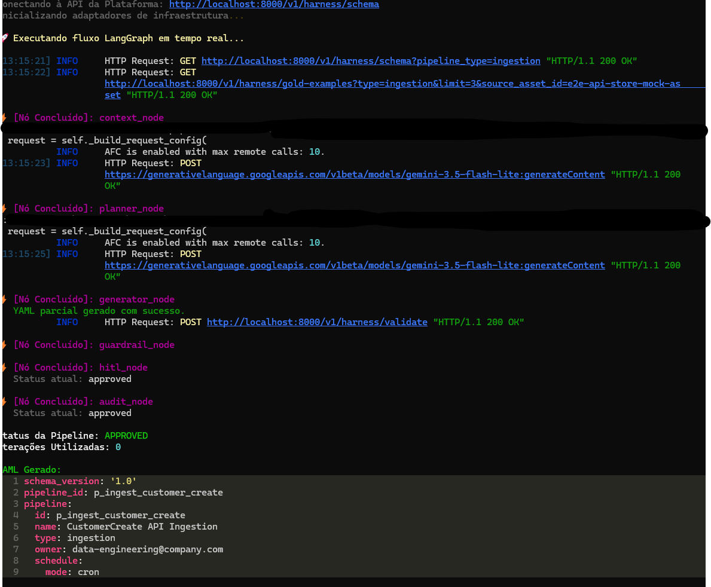
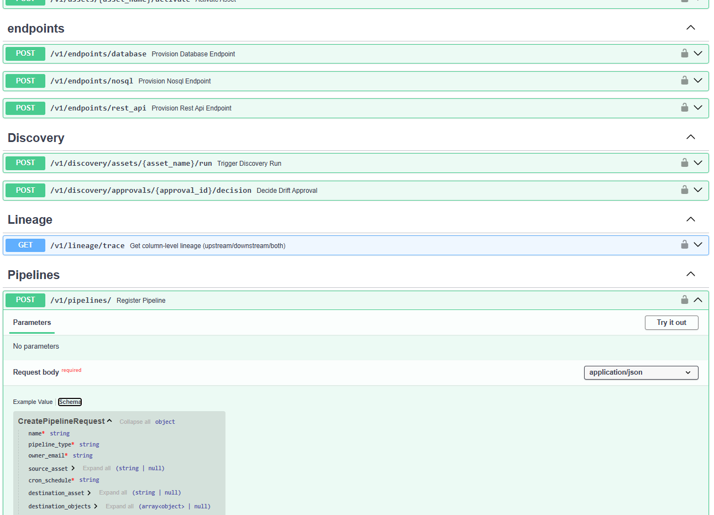
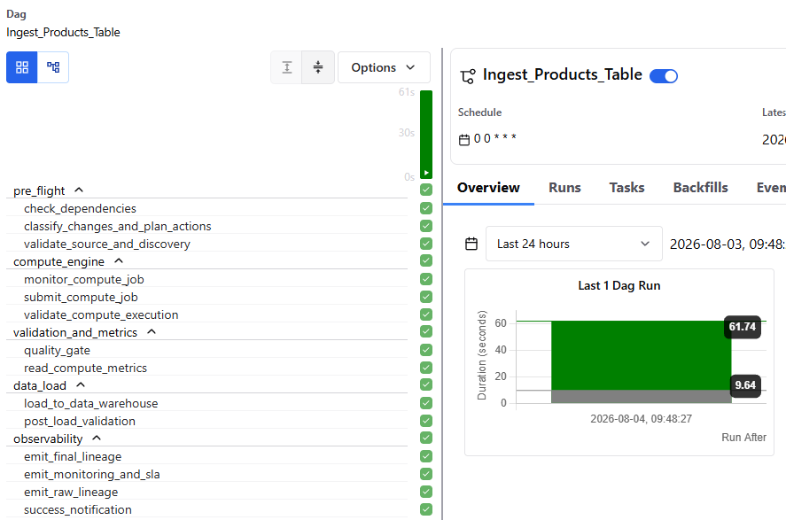
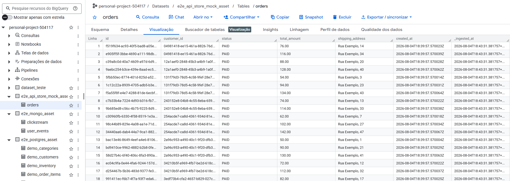

# Airflow Modern Data Platform — Architectural Showcase


Este repositório é um **projeto pessoal focado no design de arquitetura de plataformas de dados modernas**. O objetivo principal não é o tuning de performance em escala extrema, mas sim a criação de uma estrutura conceitual, genérica e altamente desacoplada, utilizando **Domain-Driven Design (DDD)** e **Clean Architecture**.

A plataforma foi projetada para ser flexível e evolutiva, permitindo a fácil substituição e adição de novas ferramentas e regras de negócio sem alterar o núcleo do domínio.

### 🤖 Desenvolvimento Assistido por IA (Spec-Driven Development)
Todo o software foi concebido e codificado utilizando a metodologia de **Spec-Driven Development (SDD)**, com uma abordagem baseada em agentes e automação de workflow. A construção foi orquestrada por meio de ferramentas especializadas como o ecossistema [Superpowers](https://github.com/obra/superpowers/tree/main) (para isolamento de tarefas técnicas de TDD e debugging), o [Strategist Skill](https://github.com/SergioLacerda/strategist-skill/) e o [SDD Harness](https://sergiolacerda.github.io/sdd-harness/).

Uma das grandes lições deste projeto é que **o design estrutural e a clareza do código são infinitamente mais importantes do que o poder ou o preço da LLM utilizada**. Nesse projeto utilizei somente Gemini como versão paga (3.5 flash e 3.1 pro), e Claude Sonnet 4.6 e Chat GPT free para ajudar em alguns conceitos e correções no julgamento do que cada LLM entregava. Mesmo sem usar as IAs mais caras do mercado para a escrita direta de código, o foco estrito em seguir boas práticas clássicas de engenharia de software (*Clean Code*, *Clean Architecture* e *DDD*) foi o fator chave que permitiu à plataforma ser altamente flexível e evolutiva.

Como destacado no artigo **[Clean Code for AI Agents (Akita on Rails)](https://akitaonrails.com/en/2026/04/20/clean-code-for-ai-agents/)**, estruturar o software com baixo acoplamento, responsabilidades isoladas (SRP) e interfaces claras (Protocols) é o fator crítico para que assistentes virtuais de código consigam trabalhar de forma autônoma de maneira precisa e confiável, sem alucinar ou introduzir regressões de escopo.

---

## 🧠 Ingestion Pipeline Harness & LangGraph Engineering

Para garantir que a geração de pipelines a partir de prompts em linguagem natural seja determinística e sempre produza **YAMLs 100% válidos e sintaticamente corretos para a plataforma**, o ecossistema utiliza um **Harness de IA orquestrado por LangGraph**.

### 🔄 Fluxo do Grafo de Estados (LangGraph StateGraph)



#### Papel de Cada Nó no Grafo:
1. **`ContextFetcherNode`**: Conecta ao catálogo da plataforma (`data_elements`, `data_assets`) para resolver schemas, tipos normalizados, chaves primárias e tags de sensibilidade (`policy_tags` como PII/Restrito).
2. **`GeneratorNode`**: Utiliza LLM com engenharia de prompt restritiva para estruturar a definição declarativa da pipeline (fontes, destino, estratégias de carga, quality gates e agendamento cron).
3. **`AuditNode & Validator`**: Valida o YAML contra os contratos e esquemas Pydantic da plataforma (`PipelineValidator`), garantindo que nenhuma instrução inválida chegue ao ambiente de produção.
4. **`HITLNode` (Human-in-the-Loop & Feedback Loop)**: Em caso de erro de validação ou qualidade, o nó de feedback alimenta o contexto do `GeneratorNode` com os erros exatos para auto-correção iterativa.

### 📸 Teste Real de Execução E2E do Grafo LangGraph

*Execução E2E do Harness mostrando a leitura de contexto do catálogo, validação de regras de negócio e geração automatizada de YAMLs para a plataforma.*

---

## 🏗️ Visão Geral da Arquitetura & Modularidade

A plataforma resolve o acoplamento excessivo que costuma ocorrer em ambientes de engenharia de dados ao isolar a lógica de negócio do orquestrador (Apache Airflow 3). O design segue a separação em camadas:

1.  **Domain (`app/domain`)**: O coração da plataforma, contendo entidades puras (`Pipeline`, `DataAsset`, `PipelineRun`) e Value Objects sem nenhuma dependência de frameworks.
2.  **Application (`app/application`)**: Casos de uso (`RegisterPipeline`, `RunDiscovery`) e definições de portas (`UnitOfWork`, `SecretManagerPort`) expressas como `Protocols` Python.
3.  **Infrastructure (`app/infrastructure`)**: Adaptadores que implementam os protocolos (SQLAlchemy Repositories, OpenBao/Vault Client, DuckDB Local Compute Engine).

### Capacidade de Evolução
*   **Secret Management:** A resolução de credenciais é feita via `SecretManagerPort`. O projeto implementa um adaptador para o **OpenBao (Vault)**, mas pode facilmente plugar serviços como AWS Secrets Manager ou Google Secret Manager.
*   **Metadata Discovery:** Mapeamento automático de schemas. Implementado para Bancos Relacionais (`database`), Bancos NoSQL (**MongoDB** via driver assíncrono `motor`) e **APIs REST** (via OpenAPI specification parsing), suportando estratégias inteligentes de inferência (como parsing de `$jsonSchema` no Mongo e `/openapi.json` em REST APIs). Inclui suporte a `scope_exclude` para filtrar coleções e schemas indesejados.
*   **Compute Engines (Ingestão/ETL/Export):** Através do `ComputeJobAdapter`, a execução física é abstraída. A plataforma conta com o **DuckDbComputeAdapter** para bancos locais e o **RestApiComputeAdapter** para ingestão de APIs HTTP com paginação assíncrona (`page_number`, `offset_limit`, `cursor` e `none`) e escrita Parquet em background thread.
*   **DWH Loading (Carga em Data Warehouses):** Padrão **Write-Audit-Publish** com adaptadores desacoplados (`DwhLoaderPort`) para carregar arquivos estruturados (Parquet/Avro) gerados pelo Compute Engine para destinos analíticos modernos (Google BigQuery, Databricks, Snowflake). Resolução híbrida de credenciais de carga em tempo de execução via IAM ou Vault.
*   **Processamento Completo:** A arquitetura suporta conceitualmente pipelines de Ingestão (Landing), transformação de dados (ETL entre Clean/Refined) e Exportação para sistemas externos, tudo governado e monitorado pela mesma API.

---

## 📖 Central de Documentação do Projeto

Para entender as especificações detalhadas do projeto, navegue pelas documentações técnicas oficiais na pasta `docs/`:

### 🚀 Visão & Governança
*   **[Visão da Plataforma (docs/vision.md)](docs/vision.md):** O problema de negócio resolvido, objetivos e escopo do projeto.
*   **[Ciclo de Vida de Ingestão e Qualidade (docs/asset_lifecycle.md)](docs/asset_lifecycle.md):** Regras de qualidade (quality gates), estados operacionais de runs e ciclo de feedback com o Airflow.
*   **[Stakeholders e Governança de Acesso (docs/stakeholders.md)](docs/stakeholders.md):** Matriz de permissões por perfil (PO/PM, SRE, Analytics Engineer) e governança de ativação.

### 🏗️ Arquitetura & Engenharia
*   **[Regras de Negócio e Fluxos (docs/business_rules.md)](docs/business_rules.md):** Modela conceitualmente a separação entre `DataAsset` (lógico) e `Endpoint` (conectividade física via Vault/OpenBao), detalhando também os fluxos core (descoberta de metadados, pipelines, quality gates e linhagem).
*   **Modelagem C4 ([Contexto](docs/c4_model/context.md) / [Containers](docs/c4_model/containers.md)):** Diagramas C4 de contexto e containers de infraestrutura.
*   **[Guia de Clean Code & DDD (docs/clean-code.md)](docs/clean-code.md):** Normas de código limpo, camadas do hexágono, uso de Value Objects e TDD.

### ⚙️ Operação & DevOps
*   **[Guia de Operações Local (docs/operations_guide.md)](docs/operations_guide.md):** Bootstrap do cluster local via Docker Compose, uso do banco `platform_db`, comandos de CLI e API.
*   **[Guia de Automação de CI/CD (docs/ci_cd_guide.md)](docs/ci_cd_guide.md):** Funcionamento do pipeline de integração contínua (Ruff, Mypy) e compilação/sincronização de DAGs.

---

## 🧪 Cobertura de Testes e Validação de Integrações

O projeto é guiado por testes rigorosos que garantem o correto funcionamento dos fluxos sem acoplamento operacional:

*   **Testes de Unidade (`tests/unit`):** Testam a lógica pura de domínio e casos de uso isolados de I/O por meio de stashes/mocks nomeados de banco e segurança.
*   **Testes de Integração (`tests/integration`):** Validam persistência contra banco em memória e geração de código.
*   **Testes E2E (`tests/e2e`):** Rodam no ambiente Docker Compose e garantem o funcionamento integrado de:
    *   Resolução segura de segredos em tempo de execução via **OpenBao (Vault)**.
    *   Conexão física e mapeamento automático via **Discovery Runner** (Database).
    *   Disparos de ingestão assíncrona pelo **DuckDbComputeAdapter** que lê tabelas PostgreSQL e exporta arquivos Parquet consolidados e estruturados junto com arquivos de metadados (`metrics.json` e `schema.json`).


## 🛠️ Iniciando o Ambiente

Suba todo o ecossistema local com um único comando:

1.  **Inicializar ambiente:**
    ```bash
    docker compose up -d --build
    ```
2.  **Acessar ferramentas:**
    -   **Airflow UI:** `http://localhost:8080` (admin/admin)
    -   **Documentação Swagger (API):** `http://localhost:8000/docs`
    -   **OpenBao (Vault):** `http://localhost:8200` (token: `root`)

3.  **Executar os testes:**
    -   Apenas Testes Unitários/Integração (independentes de Docker):
        ```bash
        uv run pytest -m "not e2e" -v
        ```
    -   Testes E2E Completos (dentro da rede Docker Compose):
        ```bash
        docker compose run --rm e2e-tests
        ```

---
## 📸 Evidências Visuais e Demonstração da Plataforma

Confira abaixo as telas de demonstração do funcionamento integrado da plataforma:

### 1. Documentação Interativa da API (Swagger / OpenAPI)

*Interface FastAPI para cadastro de DataAssets, Endpoints, execução de Metadata Discovery e provisionamento de Pipelines.*

### 2. Orquestração e DAGs Geradas (Apache Airflow 3)

*DAGs de Ingestão geradas dinamicamente via templates Jinja, integradas ao Task SDK do Airflow 3.*

### 3. Carga e Estruturação no Data Warehouse (Google BigQuery)

*Provisionamento automático de Datasets e Tabelas no BigQuery com dados carregados via padrão Write-Audit-Publish.*
---
## 🔐 Autenticação GCP & BigQuery

O ambiente suporta integração com Google BigQuery sem necessidade de credenciais ou arquivos JSON de service accounts versionados no repositório:

1. **Autenticação Padrão (Recomendado para Dev Local):**
   Execute o comando de Application Default Credentials (ADC):
   ```bash
   gcloud auth application-default login
   ```
2. **Uso de Chave de Service Account (opcional):**
   Se utilizar um arquivo `.json` de Service Account localmente, armazene-o **obrigatoriamente fora do repositório** e configure a variável de ambiente no arquivo `.env` (gitignored):
   ```bash
   GOOGLE_APPLICATION_CREDENTIALS=/caminho/fora/do/repo/sua-chave.json
   PLATFORM_GCP_PROJECT=seu-gcp-project-id
   PLATFORM_DWH_PROVISIONER_ADAPTER=bigquery
   ```
