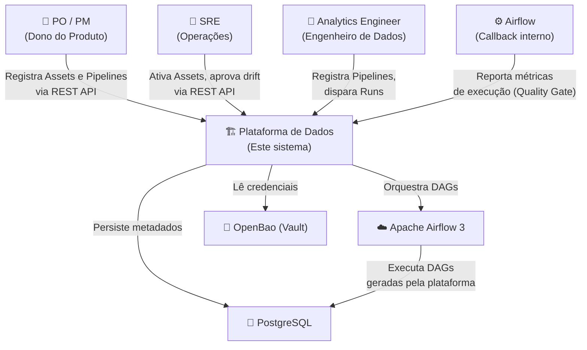
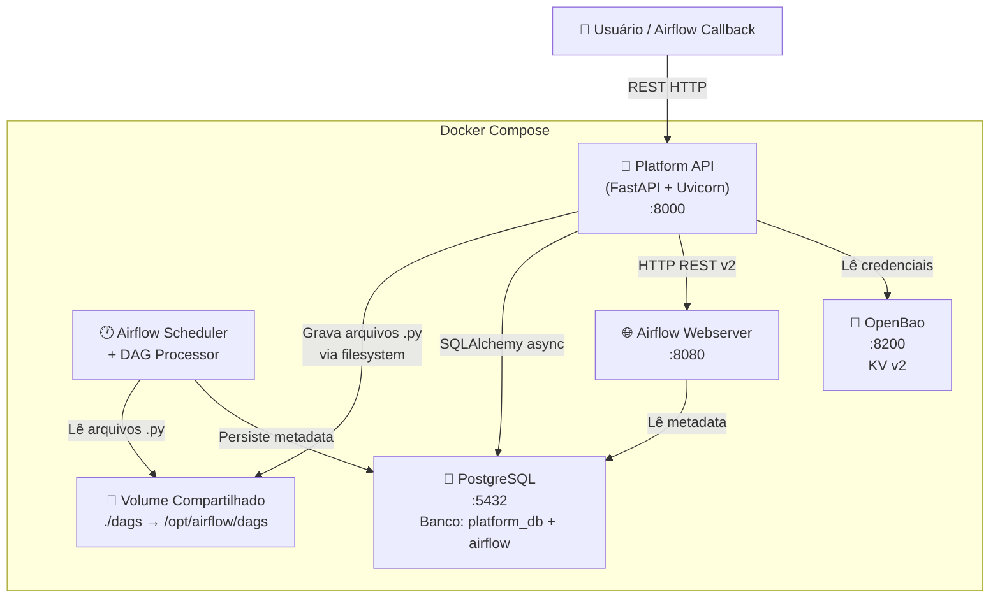
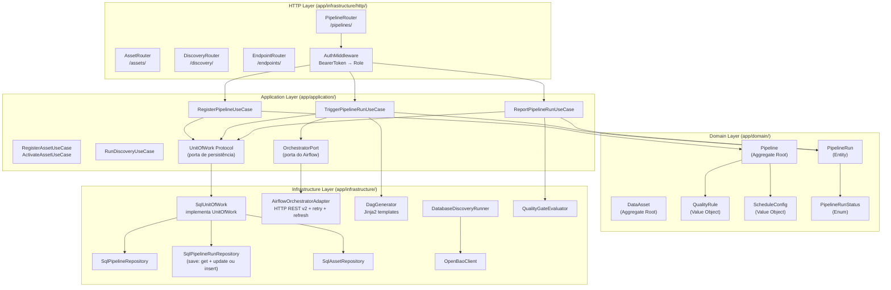
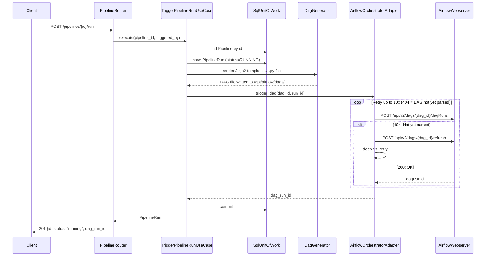
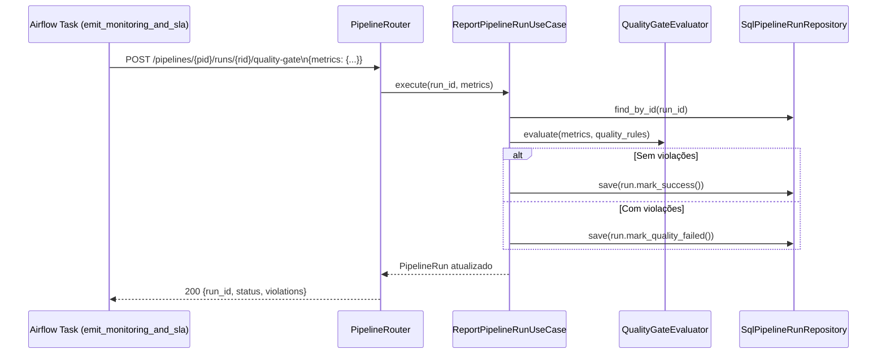

# Arquitetura C4 — Plataforma de Dados

Este documento descreve a arquitetura da plataforma usando o modelo C4 (Context, Containers, Components, Code).

---

## Nível 1 — Contexto do Sistema

---

## Nível 2 — Containers

---

## Nível 3 — Componentes da Platform API

---

## Fluxo: Trigger de Pipeline Run (sequência interna)

---

## Fluxo: Quality Gate (callback do Airflow)

