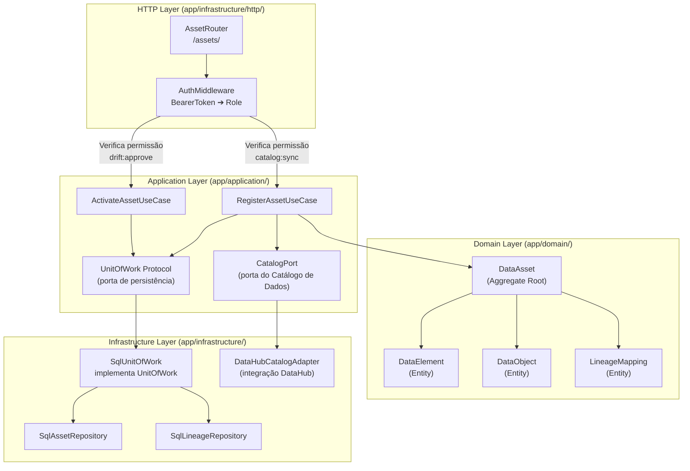

# Nível 3: Componentes de Data Assets

Este documento descreve a organização e componentes internos do domínio de **Data Assets** (recursos de dados expostos, tabelas lógicas catalogadas e linhagem de dados).

### Principais Componentes

1. **AssetRouter (`app/infrastructure/http/routers/asset_router.py`)**:
   - Expõe os endpoints REST para criar novos data assets, gerenciar a ativação/desativação de tabelas ou visualização do grafo de linhagem.

2. **RegisterAssetUseCase (`app/application/use_cases/register_asset.py`)**:
   - Registra novos assets declarativos na plataforma. Quando o asset é cadastrado, as informações de linhagem mapeadas são publicadas para sistemas de metadados externos por meio do `CatalogPort`.

3. **ActivateAssetUseCase (`app/application/use_cases/activate_asset.py`)**:
   - Altera o estado operacional do asset. Um asset ativo fica elegível para receber execuções de discovery e novos agendamentos de ingestão ou validações de qualidade.

4. **CatalogPort (`app/application/ports/catalog_port.py`)**:
   - Porta que define o contrato de integração para publicação de schemas e relações de linhagem em catálogos corporativos.

5. **DataHubCatalogAdapter (`app/infrastructure/adapters/catalog/datahub_catalog_adapter.py`)**:
   - Implementa a porta `CatalogPort`. Conecta-se à API do DataHub e emite mensagens MCP (Metadata Change Proposals) registrando os datasets e a linhagem computada na plataforma.

6. **DataAsset (`app/domain/discovery/data_asset.py`)**:
   - Aggregate Root que reúne metadados de negócios, mapeando `DataElement` (colunas lógicas), `DataObject` (tabelas físicas) e suas relações de dependência a montante e a jusante (`LineageMapping`).
