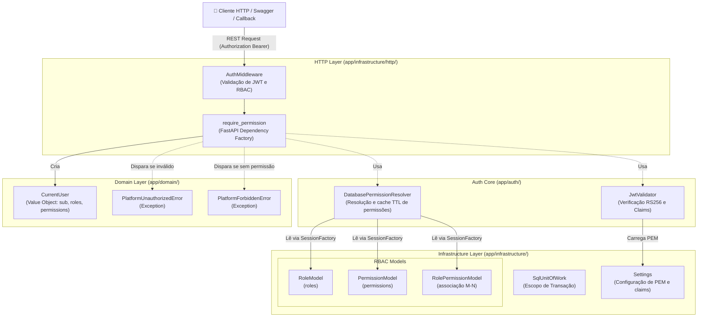

# Nível 3: Componentes de Autenticação e RBAC

Este documento descreve os componentes internos responsáveis pela segurança da plataforma, incluindo validação criptográfica de tokens JWT (RS256) e resolução de permissões granulares via Role-Based Access Control (RBAC).

### Principais Componentes

1. **AuthMiddleware / require_permission (`app/infrastructure/http/routers/`)**:
   - Dependency factory do FastAPI que intercepta as chamadas de API, extrai o Bearer token do header, invoca a cadeia de validação e injeta a entidade `CurrentUser` no endpoint.

2. **JwtValidator (`app/auth/jwt_validator.py`)**:
   - Responsável por validar a assinatura criptográfica RS256 usando a chave pública PEM cadastrada em `Settings`.
   - Verifica data de expiração (`exp`), audience (`aud`), issuer (`iss`) e extrai as roles do usuário a partir da claim configurada (ex: claim `roles` ou um caminho aninhado).

3. **DatabasePermissionResolver (`app/auth/permission_resolver.py`)**:
   - Conecta-se às tabelas do banco de dados para buscar a lista de permissões associadas às roles extraídas do JWT.
   - Utiliza um dicionário de cache local com expiração baseada em tempo (TTL) para evitar chamadas excessivas ao banco de dados em requests sequenciais do mesmo usuário.

4. **RoleModel / PermissionModel / RolePermissionModel (`app/infrastructure/persistence/models/`)**:
   - Modelos ORM que representam o esquema físico de controle de acesso:
     - `RoleModel`: Nomes de roles como `sre`, `po_pm` e `analytics_engineer`.
     - `PermissionModel`: Permissões granulares como `pipeline:trigger`, `drift:approve`.
     - `RolePermissionModel`: Tabela associativa que liga N permissões a N roles.
