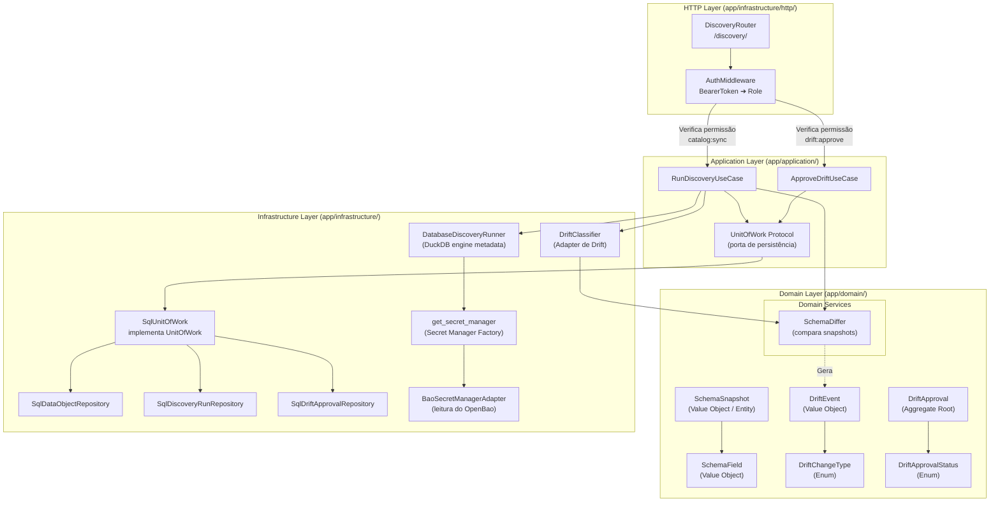

# Nível 3: Componentes de Discovery e Schema Drift

Este documento detalha os componentes do domínio de **Schema Discovery** e a inteligência de comparação e classificação de alterações estruturais (**Schema Drift**).

### Principais Componentes

1. **DiscoveryRouter (`app/infrastructure/http/routers/discovery_router.py`)**:
   - Expõe endpoints para iniciar o discovery de um schema, listar execuções de discovery, visualizar drifts pendentes de aprovação e submeter decisões de aprovação/rejeição (SRE).

2. **RunDiscoveryUseCase (`app/application/use_cases/run_discovery.py`)**:
   - Orquestra o ciclo de discovery: obtém credenciais de conexão, dispara o `DatabaseDiscoveryRunner` para inspecionar fisicamente as tabelas do banco de dados, gera um `SchemaSnapshot` atual e calcula o drift em relação ao snapshot anterior ativo utilizando o `SchemaDiffer`.

3. **DatabaseDiscoveryRunner (`app/infrastructure/discovery/database_discovery_runner.py`)**:
   - Conecta-se à base de dados de origem (ex: utilizando credenciais resolvidas pelo Secret Manager) e executa queries de inspeção para obter nomes de tabelas, tipos de dados, nulabilidade e chaves primárias.

4. **BaoSecretManagerAdapter (`app/infrastructure/adapters/secrets/bao_secret_manager_adapter.py`)**:
   - Implementa o mecanismo de comunicação segura com o OpenBao (Vault) via REST API para ler credenciais armazenadas na engine KV v2 de forma transparente para a aplicação de discovery.

5. **SchemaDiffer (`app/domain/discovery/services/schema_differ.py`)**:
   - Serviço de domínio puro. Recebe o snapshot anterior e o novo snapshot e calcula detalhadamente a lista de `DriftEvent` (campos adicionados, removidos, alterações de nulabilidade e incompatibilidade de tipos de dados).

6. **DriftClassifier (`app/infrastructure/drift_classifier.py`)**:
   - Adapter de infraestrutura que atua como gate para pipelines de ETL. Recebe dicionários serializados de schemas, converte-os em estruturas de domínio e avalia se o pipeline pode ou não seguir de acordo com a gravidade dos `DriftEvent` mapeados (campos removidos ou tipos incompatíveis bloqueiam o pipeline).

7. **ApproveDriftUseCase (`app/application/use_cases/approve_drift.py`)**:
   - Permite que um usuário com a role correta (SRE) aprove formalmente um drift de schema bloqueante, aplicando a alteração e atualizando o snapshot ativo no catálogo de assets da plataforma.
