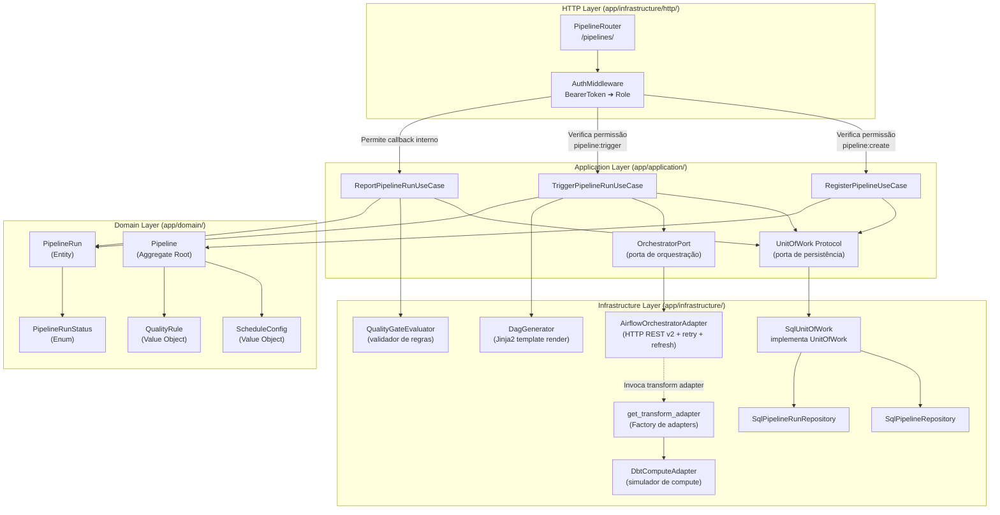

# Nível 3: Componentes de Pipelines

Este documento detalha a arquitetura interna e componentes do domínio de **Pipelines**, incluindo a recepção de requisições, a orquestração com o Apache Airflow e a geração dinâmica de DAGs.

### Principais Componentes

1. **PipelineRouter (`app/infrastructure/http/routers/pipeline_router.py`)**:
   - Expõe os endpoints REST para criar pipelines, listar execuções, disparar novos runs manualmente e receber callbacks do Airflow.

2. **RegisterPipelineUseCase (`app/application/use_cases/register_pipeline.py`)**:
   - Valida os dados de entrada, instancia o aggregate root `Pipeline` com suas regras de qualidade (`QualityRule`) e configuração de agendamento (`ScheduleConfig`), e o persiste no repositório.

3. **TriggerPipelineRunUseCase (`app/application/use_cases/trigger_pipeline_run.py`)**:
   - Cria uma nova entidade `PipelineRun` com status `RUNNING`, invoca o `DagGenerator` para salvar o arquivo físico da DAG no volume compartilhado, e faz a chamada via `OrchestratorPort` para iniciar a execução imediatamente no Airflow.

4. **ReportPipelineRunUseCase (`app/application/use_cases/report_pipeline_run.py`)**:
   - Processa os resultados de qualidade de dados (Quality Gate) enviados ao final de uma execução no Airflow. Compara as métricas enviadas com as regras cadastradas no pipeline usando o `QualityGateEvaluator`, atualizando o status do run para `SUCCESS` ou `QUALITY_FAILED`.

5. **DagGenerator (`app/infrastructure/yaml_generator/pipeline_yaml_generator.py`)**:
   - Renderiza templates Jinja2 em arquivos Python executáveis pelo Airflow, contendo a estrutura da DAG, as tarefas de extração/carga e os callbacks de qualidade de dados.

6. **AirflowOrchestratorAdapter (`app/infrastructure/adapters/orchestrator/airflow_orchestrator_adapter.py`)**:
   - Implementa a porta `OrchestratorPort`. Controla a resiliência de chamadas HTTP para a API REST do Airflow. Se a DAG recém-gerada ainda não foi parseada pelo Airflow (HTTP 404), dispara um comando `/refresh` e executa retries exponenciais.

7. **DbtComputeAdapter (`app/infrastructure/adapters/compute/dbt_compute_adapter.py`)**:
   - Implementa a porta de computação de transformação para pipelines que utilizam dbt. Simula de maneira assíncrona o ciclo de vida do dbt build e gera um arquivo com métricas sintéticas para validação do Quality Gate.
