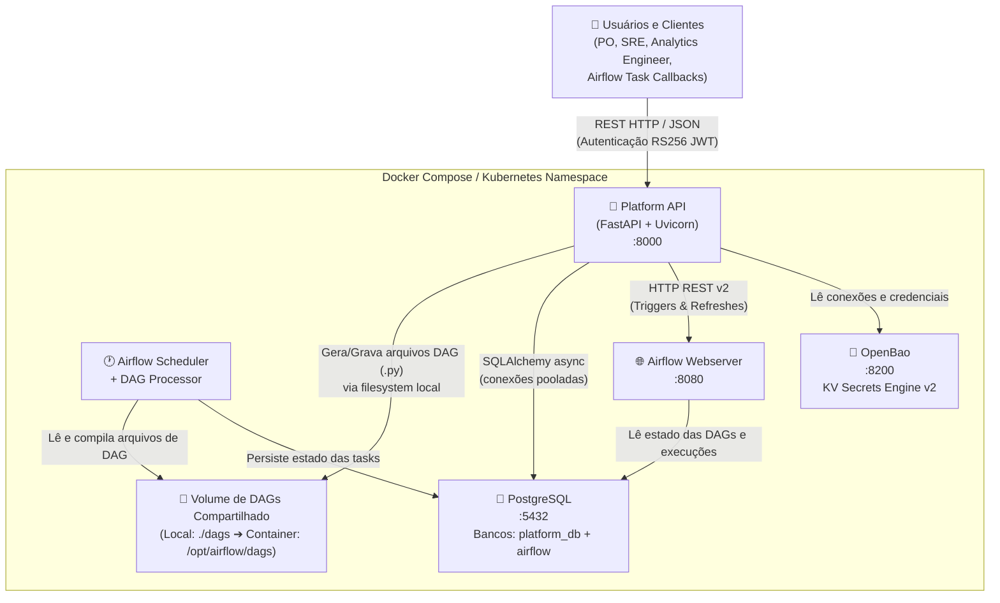

# Nível 2: Containers

Este documento descreve a topologia dos containers do sistema, mostrando como as aplicações interagem entre si dentro do ecossistema de implantação (ex: Docker Compose / Kubernetes).

### Detalhamento dos Containers

1. **Platform API (FastAPI + Uvicorn)**:
   - **Tecnologia**: Python 3.12, FastAPI, Uvicorn, SQLAlchemy.
   - **Papel**: Core do sistema. Expõe os endpoints REST, valida tokens JWT, resolve permissões via RBAC no banco de dados, gera as DAGs correspondentes aos pipelines e submete requisições ao Airflow.
   - **Protocolos**: HTTP/JSON para clientes; SQLAlchemy Async (asyncpg) para PostgreSQL; HTTP REST para Airflow; HTTP API para OpenBao.

2. **Airflow Webserver / API**:
   - **Tecnologia**: Apache Airflow.
   - **Papel**: Interface web do orquestrador e API REST oficial do Airflow. Recebe comandos de trigger e refresh da Platform API.

3. **Airflow Scheduler**:
   - **Tecnologia**: Apache Airflow.
   - **Papel**: Compila dinamicamente as DAGs depositadas no volume compartilhado, agenda as execuções e dispara as tasks de compute (como DuckDB, dbt ou queries SQL).

4. **PostgreSQL**:
   - **Tecnologia**: PostgreSQL 16+.
   - **Papel**: Banco de dados relacional. Contém duas instâncias lógicas (ou schemas): uma para os metadados da Plataforma (tabelas de pipelines, runs, assets, RBAC, auditoria) e outra para o controle interno de estado do Airflow.

5. **OpenBao (Vault)**:
   - **Tecnologia**: OpenBao (fork open-source do HashiCorp Vault).
   - **Papel**: Armazenamento seguro de segredos de conexão. Protege as credenciais das fontes de dados externas consultadas no fluxo de Discovery.

6. **Shared DAGs Volume**:
   - **Tecnologia**: Volume compartilhado (filesystem de rede ou bind mount).
   - **Papel**: Ponto de acoplamento físico entre a API e o Airflow. Qualquer pipeline novo ou editado gera um arquivo Python renderizado via Jinja2 gravado aqui, que é lido e parseado quase instantaneamente pelo scheduler do Airflow.
