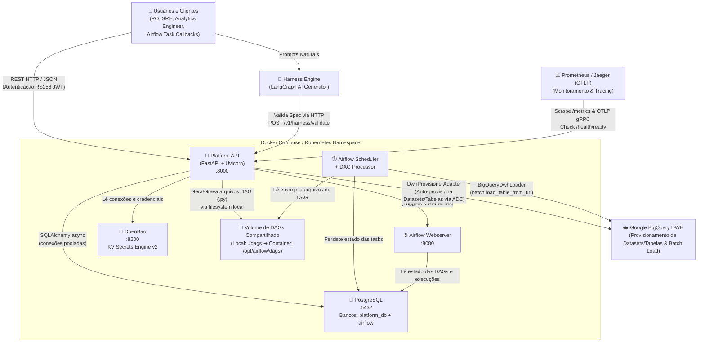

# Nível 2: Containers

Este documento descreve a topologia dos containers do sistema, mostrando como as aplicações interagem entre si dentro do ecossistema de implantação (ex: Docker Compose / Kubernetes).

```mermaid
graph TD
    CLIENT["👤 Usuários e Clientes\n(PO, SRE, Analytics Engineer,\nAirflow Task Callbacks)"]

    subgraph "Docker Compose / Kubernetes Namespace"
        API["🐍 Platform API\n(FastAPI + Uvicorn)\n:8000"]
        SCHED["🕐 Airflow Scheduler\n+ DAG Processor"]
        WEB["🌐 Airflow Webserver\n:8080"]
        PG["🐘 PostgreSQL\n:5432\nBancos: platform_db + airflow"]
        VAULT["🔐 OpenBao\n:8200\nKV Secrets Engine v2"]
        DAGS["📁 Volume de DAGs Compartilhado\n(Local: ./dags ➔ Container: /opt/airflow/dags)"]
    end

    PROM["📊 Prometheus / Jaeger (OTLP)\n(Monitoramento & Tracing)"]
    BQ["☁️ Google BigQuery DWH\n(Provisionamento de Datasets/Tabelas & Batch Load)"]
    HARNESS["🤖 Harness Engine\n(LangGraph AI Generator)"]

    CLIENT -->|"REST HTTP / JSON\n(Autenticação RS256 JWT)"| API
    CLIENT -->|"Prompts Naturais"| HARNESS
    HARNESS -->|"Valida Spec via HTTP\nPOST /v1/harness/validate"| API
    API -->|"Gera/Grava arquivos DAG (.py)\nvia filesystem local"| DAGS
    API -->|"SQLAlchemy async\n(conexões pooladas)"| PG
    API -->|"HTTP REST v2\n(Triggers & Refreshes)"| WEB
    API -->|"Lê conexões e credenciais"| VAULT
    API -->|"DwhProvisionerAdapter\n(Auto-provisiona Datasets/Tabelas via ADC)"| BQ

    SCHED -->|"Lê e compila arquivos de DAG"| DAGS
    SCHED -->|"Persiste estado das tasks"| PG
    SCHED -->|"BigQueryDwhLoader\n(batch load_table_from_uri)"| BQ
    WEB -->|"Lê estado das DAGs e execuções"| PG

    PROM -->|"Scrape /metrics & OTLP gRPC\nCheck /health/ready"| API
```

### Detalhamento dos Containers

1. **Platform API (FastAPI + Uvicorn)**:
   - **Tecnologia**: Python 3.12, FastAPI, Uvicorn, SQLAlchemy.
   - **Papel**: Core do sistema. Expõe os endpoints REST, valida tokens JWT, resolve permissões via RBAC no banco de dados, gera as DAGs correspondentes aos pipelines, submete requisições ao Airflow e invoca o `DwhProvisionerAdapter` para provisionar fisicamente datasets e tabelas no Data Warehouse.
   - **Protocolos**: HTTP/JSON para clientes; SQLAlchemy Async (asyncpg) para PostgreSQL; HTTP REST para Airflow; HTTP API para OpenBao; gRPC/HTTPS ADC para Google BigQuery.

2. **Airflow Webserver / API**:
   - **Tecnologia**: Apache Airflow.
   - **Papel**: Interface web do orquestrador e API REST oficial do Airflow. Recebe comandos de trigger e refresh da Platform API.

3. **Airflow Scheduler & Workers**:
   - **Tecnologia**: Apache Airflow 3, OmniBeam (Go binary), dbt Core 1.12.
   - **Papel**: Compila dinamicamente as DAGs depositadas no volume compartilhado, agenda as execuções, dispara as tasks de compute:
     - **OmniBeam**: Executa o parsing concorrente de arquivos brutos (JSON/CSV) em background process para Parquet.
     - **dbt Core**: Executa `dbt build` para transformações em camadas Medallion (Staging ➔ Silver ➔ Gold).
     - **DWH Loader**: Executa o carregamento em lote nativo no DWH (`BigQueryDwhLoader`).

4. **PostgreSQL**:
   - **Tecnologia**: PostgreSQL 16+.
   - **Papel**: Banco de dados relacional. Contém duas instâncias lógicas (ou schemas): uma para os metadados da Plataforma (tabelas de pipelines, runs, assets, arquivos de execução `pipeline_run_files`, RBAC, auditoria) e outra para o controle interno de estado do Airflow.

5. **OpenBao (Vault)**:
   - **Tecnologia**: OpenBao (fork open-source do HashiCorp Vault).
   - **Papel**: Armazenamento seguro de segredos de conexão. Protege as credenciais das fontes de dados externas consultadas no fluxo de Discovery.

6. **Shared DAGs Volume**:
   - **Tecnologia**: Volume compartilhado (filesystem de rede ou bind mount).
   - **Papel**: Ponto de acoplamento físico entre a API e o Airflow. Qualquer pipeline novo ou editado gera um arquivo Python renderizado via Jinja2 gravado aqui, que é lido e parseado quase instantaneamente pelo scheduler do Airflow.

7. **Prometheus & Jaeger (OpenTelemetry)**:
   - **Tecnologia**: Prometheus + Jaeger All-in-One (OTLP gRPC).
   - **Papel**: Coleta métricas de séries temporais (`/metrics`) e rastreamento distribuído (spans OpenTelemetry em OTLP/gRPC na porta 4317). Gerencia alertas de integridade baseados nos endpoints `/health` e `/health/ready`.

8. **Google BigQuery DWH (Medallion Datasets)**:
   - **Tecnologia**: GCP BigQuery / Cloud DWH.
   - **Papel**: Data Warehouse corporativo estruturado em datasets Medallion:
     - `platform_bronze`: Dados brutos ingeridos com metadados de auditoria (`_ingested_at`, `_source_file`).
     - `platform_silver`: Dados limpos, tipados, deduplicados e particionados via dbt Core.
     - `platform_gold`: Modelagem dimensional Kimball e tabelas analíticas para detecção de fraudes (`gold_fraud_alerts`).

9. **Harness Engine (AI Generator)**:
   - **Tecnologia**: LangGraph + Python.
   - **Papel**: Motor autônomo de geração de pipelines a partir de prompts em linguagem natural. Utiliza o endpoint `POST /v1/harness/validate` como guardrail de validação sintática e semântica antes de persistir as especificações.
