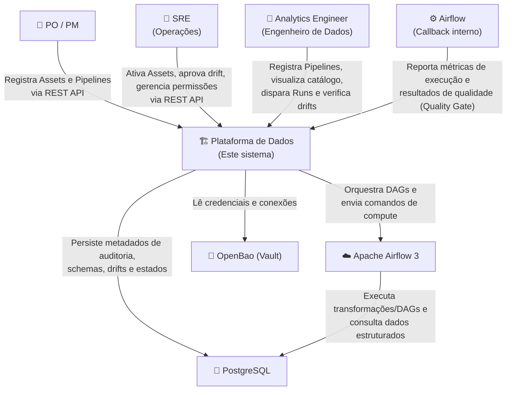

# Nível 1: Contexto do Sistema

Este documento descreve o contexto geral do sistema (System Context) e as interações da Plataforma de Dados com os atores e sistemas externos.

### Atores e Sistemas

- **PO / PM (Product Owner / Project Manager)**: Define e cadastra as regras de negócio iniciais, data assets e pipelines que descrevem o fluxo de ingestão e consumo dos dados.
- **SRE (Site Reliability Engineer)**: Gerencia o ciclo de vida operacional, ativa e desativa assets, audita permissões/RBAC e analisa e aprova drifts de schema críticos que interrompem pipelines.
- **Analytics Engineer**: Responsável pela modelagem e definição das transformações (ex: dbt/Dataform). Dispara runs e monitora a qualidade dos dados diretamente nas interfaces da plataforma.
- **Apache Airflow 3**: Orquestrador que executa as tarefas geradas pela Plataforma e faz chamadas de volta (callbacks) para relatar logs, métricas e atualizações de status.
- **OpenBao (Vault)**: Gerenciador de segredos que armazena de forma criptografada as conexões e credenciais usadas para acessar os bancos de dados de origem durante o discovery.
- **PostgreSQL**: Banco de dados relacional que atua como repositório de persistência transacional da plataforma (configurações, auditoria, RBAC, histórico de execuções).
