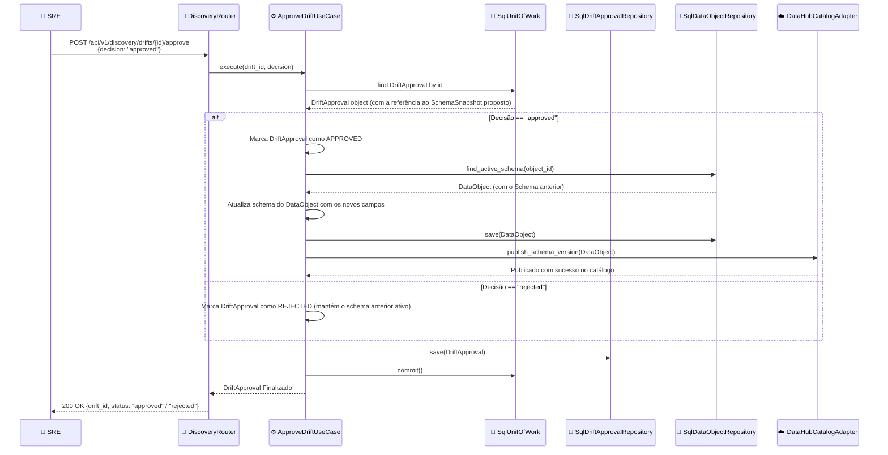

# Nível 4: Fluxo - Drift Approval Flow

Este diagrama de sequência descreve o fluxo de aprovação de drifts de schema, mostrando como um SRE resolve alterações estruturais bloqueadas nos pipelines.

### Detalhamento do Processo

1. **Ação do SRE**: Quando uma quebra de compatibilidade estrutural ocorre, o pipeline é impedido de rodar. O SRE inspeciona os detalhes do drift e toma uma ação corretiva.
2. **Atualização do Modelo**:
   - Se aprovado, a nova estrutura proposta no snapshot do discovery substitui o schema anterior cadastrado para o `DataObject`. O status do `DriftApproval` muda para `APPROVED`.
   - Se rejeitado, o `DriftApproval` muda para `REJECTED`, e a estrutura atual da plataforma continua ignorando a nova especificação, bloqueando execuções de dados subsequentes até que a fonte de origem seja normalizada ou uma nova decisão seja tomada.
3. **Publicação no Catálogo**: Em caso de aprovação, a plataforma publica a nova versão da tabela física e suas colunas para o DataHub, garantindo que o catálogo de dados corporativo esteja atualizado com o schema aprovado.
