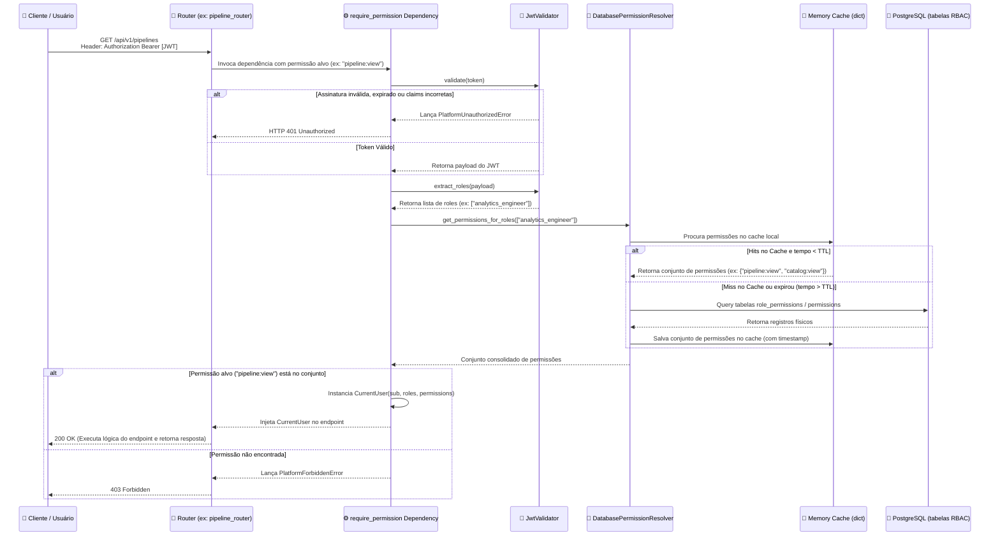

# Nível 4: Fluxo - JWT Validation e RBAC Check

Este diagrama de sequência detalha os passos que ocorrem a cada request HTTP nas rotas protegidas da plataforma para autenticar o usuário e validar suas permissões granulares de acesso.

### Detalhamento do Processo

1. **Recepção**: A cada chamada HTTP em rotas protegidas por permissão, a dependência do FastAPI `require_permission("permissao")` intercepta a chamada.
2. **Validação Criptográfica**: O `JwtValidator` faz a validação em memória do JWT usando a chave pública RSA. Erros de chave expirada ou assinatura adulterada geram erro HTTP 401 instantaneamente, sem encostar no banco de dados.
3. **Resolução de Permissões**: Como as roles vêm dentro do token JWT, a plataforma precisa converter as roles em permissões. O `DatabasePermissionResolver` cuida disso:
   - Para evitar gargalo de I/O a cada requisição, mantém um cache simples em memória estruturado por role.
   - O cache respeita o tempo máximo de vida (TTL) configurado globalmente nas variáveis de ambiente.
4. **Decisão de Acesso**: Se a permissão exigida pela rota estiver contida no conjunto mapeado, o request segue normalmente e o objeto `CurrentUser` fica disponível para a lógica de negócio do endpoint. Caso contrário, retorna HTTP 403.
