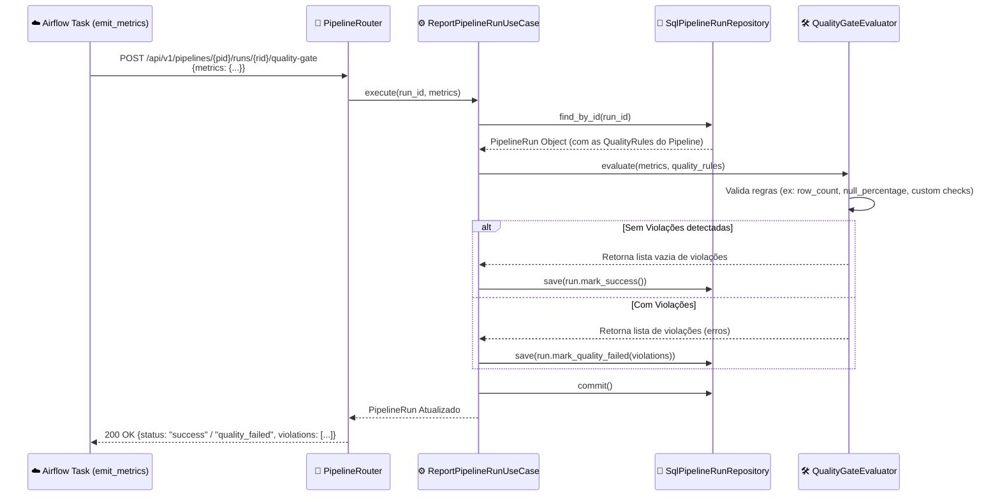

# Nível 4: Fluxo - Quality Gate Callback

Este diagrama de sequência detalha como o Airflow notifica a Plataforma de Dados sobre as métricas de qualidade coletadas após a execução de um pipeline e como as regras do Quality Gate são avaliadas.

### Detalhamento do Processo

1. **Notificação**: Uma das últimas tasks de qualquer DAG orquestrada é a task de auditoria de qualidade. Ela envia os metadados brutos gerados pela execução do job (ex: contagem de linhas, volumetria, etc.) para o endpoint `/quality-gate`.
2. **Avaliação**: O `ReportPipelineRunUseCase` busca o histórico da execução correspondente e recupera as `QualityRule` que estavam ativas quando o pipeline foi definido.
3. **Validador de Regras**: O `QualityGateEvaluator` inspeciona as regras e avalia contra os valores numéricos informados. Se qualquer regra (ex: "porcentagem de nulos na coluna X não deve passar de 5%") falhar, o validador retorna os detalhes do desvio.
4. **Persistência**: O run tem seu estado atualizado. Caso ocorra uma violação, o pipeline é marcado como `QUALITY_FAILED`. O histórico de auditoria armazena as falhas para exibição em dashboards e geração de alertas para os times de engenharia.
