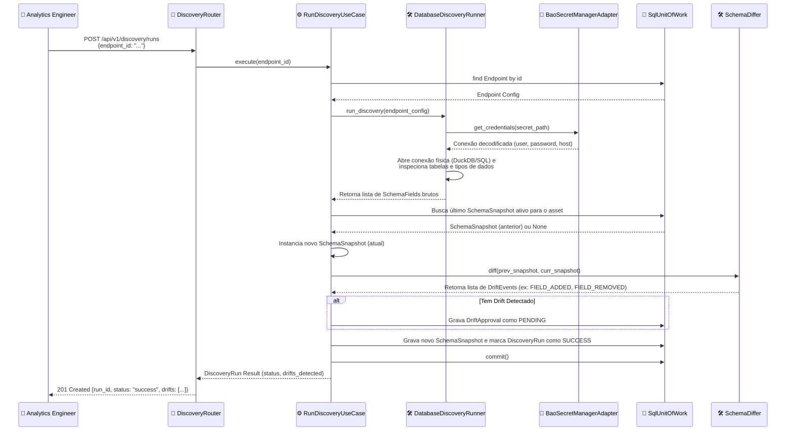

# Nível 4: Fluxo - Schema Discovery Execution

Este diagrama de sequência descreve o processo de execução de um **Discovery Run** para extrair metadados e identificar alterações estruturais (drifts) em bancos de dados de origem de forma resiliente.

### Detalhamento do Processo

1. **Trigger de Sincronização**: O engenheiro inicia o discovery para verificar se a estrutura do banco físico mudou em relação ao catálogo da plataforma.
2. **Resolução de Segredos**: O `DatabaseDiscoveryRunner` não guarda as senhas das conexões. Ele consome o `BaoSecretManagerAdapter` que recupera as credenciais criptografadas do OpenBao em tempo de execução.
3. **Inspeção Física**: Utilizando um adaptador SQL/DuckDB, o runner lê o catálogo do banco alvo e gera uma lista contendo os tipos nativos de cada coluna.
4. **Cálculo de Diferenças**: O `SchemaDiffer` de domínio compara a estrutura antiga com a atual. Eventos como inclusões, remoções ou mudanças de tipo são computados detalhadamente.
5. **Criação de Gate**: Se houver alguma mudança de schema, um registro do tipo `DriftApproval` é criado com status `PENDING`. As alterações só entrarão em vigor no catálogo corporativo após a validação do SRE.
