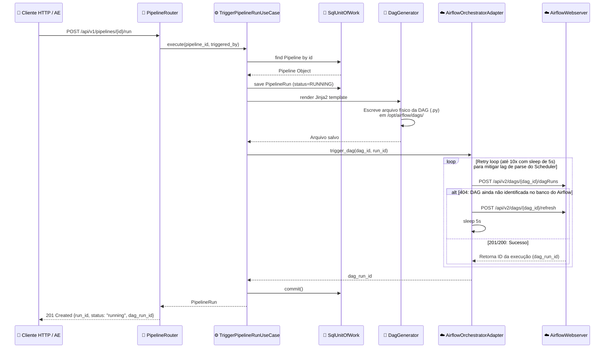

# Nível 4: Fluxo - Trigger de Pipeline

Este diagrama de sequência descreve o fluxo detalhado quando um usuário solicita o disparo manual de um pipeline por meio da REST API da plataforma.

### Detalhamento do Processo

1. **Recepção**: O cliente envia uma requisição POST que passa primeiro pelo `AuthMiddleware`. O middleware verifica se o token JWT possui a permissão `pipeline:trigger`.
2. **Registro**: A entidade `PipelineRun` é gravada no banco com o status `RUNNING`.
3. **Escrita da DAG**: O `DagGenerator` renderiza um script contendo todos os operadores correspondentes ao pipeline. O arquivo é depositado no volume que o Airflow compartilha.
4. **Trigger Assíncrono**: O adaptador HTTP faz a chamada REST para disparar a execução. Caso o Airflow ainda não tenha indexado a nova DAG (o que gera 404), o adaptador envia uma chamada para a API `/refresh` e faz novas tentativas até o Scheduler identificar a DAG gerada no filesystem.
5. **Finalização**: O run_id gerado pelo Airflow é acoplado ao metadado da plataforma e a transação do banco de dados local é persistida (`commit`).
