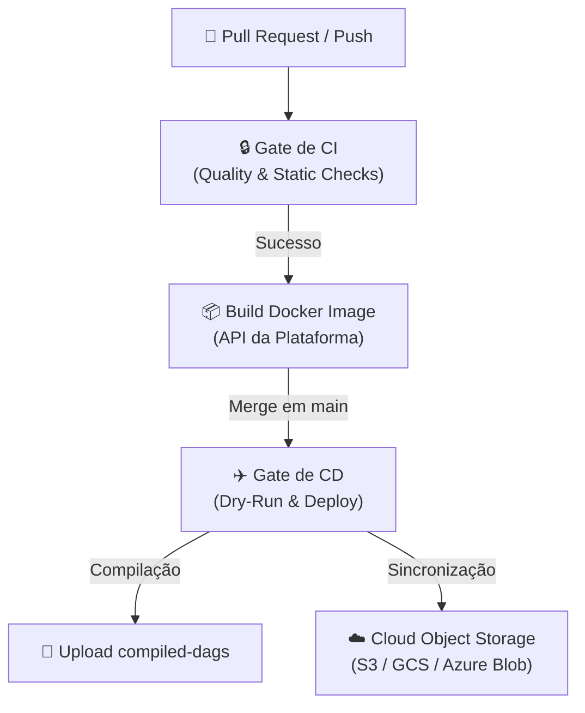

# Guia de CI/CD — Integração e Entrega Contínua

Este guia documenta o funcionamento e os estágios das pipelines de Integração Contínua (CI) e Entrega Contínua (CD) automatizadas via GitHub Actions.

---

## 1. Visão Geral do Fluxo

A automação da plataforma segue o fluxo estruturado de gates de qualidade até a entrega das DAGs e imagens nos ambientes correspondentes:



---

## 2. Integração Contínua (CI)

O workflow de CI é acionado a cada **Push** ou **Pull Request** direcionado às branches `main` e `develop`. Ele é composto pelo job `ci_gate` no arquivo [.github/workflows/ci_cd_pipeline.yml](file:///.github/workflows/ci_cd_pipeline.yml).

### Estágios do CI Gate

| Passo | Comando | Objetivo |
|---|---|---|
| **Ruff Format** | `uv run ruff format --check .` | Valida se o estilo de formatação do código segue as regras do PEP 8. |
| **Ruff Lint** | `uv run ruff check .` | Análise estática contra bugs, imports não utilizados e anti-padrões de clean code. |
| **Mypy Type Checking** | `uv run mypy app/` | Validação estática de tipos estritos para prevenir erros de runtime. |
| **YAML Validation Gate** | `uv run pytest tests/unit/infrastructure/test_ci_validator.py` | Garante que novos arquivos YAML declarados no diretório `dags/` sejam estruturalmente válidos. |
| **Testes de Unidade e Integração** | `uv run pytest -m "not e2e" -v --cov=app --cov-fail-under=80` | Executa a suite de testes locais (banco SQLite em memória). Exige no mínimo **80% de cobertura de código**. |
| **Migration Test** | `alembic upgrade head && alembic downgrade -1 && alembic upgrade head` | Valida que migrations aplicam e revertam sem erros em Postgres limpo. |

### Por que testamos migrations no CI?

Migrations desenvolvidas localmente podem falhar em produção por constraints implícitas,
ordem de execução ou dados pré-existentes. O job `test_migrations` valida o ciclo completo
upgrade → downgrade → upgrade em banco limpo no GitHub Actions, tornando schema refactoring seguro.

### Por que os testes E2E não rodam no CI?

Os testes E2E (`tests/e2e/`) exigem um cluster Docker Compose completo com Airflow, PostgreSQL real e OpenBao ativos.

**Esta é uma decisão intencional para repositório público:**
- Rodar E2E em GitHub Actions exigiria runners privados ou credenciais de cloud expostas
- O CI padrão cobre >= 80% da lógica de negócio via testes unitários e de integração
- Para executar os testes E2E completos localmente:
  ```bash
  docker compose up -d --build
  docker compose run --rm e2e-tests
  ```

Em uma organização com runners privados e secrets configurados, o job de E2E poderia ser habilitado com `docker compose up -d` dentro do runner.

---

## 3. Entrega Contínua (CD)

O pipeline de CD é acionado automaticamente **apenas após o merge com sucesso** na branch `main`.

### Estágios do CD

#### 1. Validação de DAGs (Dry Run)
Antes de enviar qualquer arquivo Python para o ambiente de execução do Airflow, o CD roda os geradores de DAG em modo simulado (`dry-run`) para comparar diffs e garantir que nenhuma DAG inválida seja compilada:
```bash
uv run python -m cli.main pipeline rebuild --template-version 2.0 --dry-run
uv run pytest tests/unit/infrastructure/test_dag_generator.py -v
```

#### 2. Compilação e Geração das DAGs
Após a validação, a CLI do projeto reconstrói fisicamente as DAGs reais convertendo os templates Jinja2 e arquivos YAML configurados em código Python:
```bash
uv run python -m cli.main pipeline rebuild --template-version 2.0
```
As DAGs prontas são salvas no diretório `output_dags/` e armazenadas como artefato temporário do GitHub Actions (`compiled-dags`).

#### 3. Sincronização com Cloud Provider

> [!WARNING]
> **DEV/SHOWCASE ONLY:** O step atual de deploy (`Deploy to Airflow Storage`) é um **mock educacional**.
> Ele imprime uma mensagem de confirmação e lista os comandos reais para cada cloud provider como comentários.
> Em um ambiente de produção real, este step deve ser substituído por um dos seguintes:
>
> - **GCP Cloud Composer:** `gsutil -m rsync -r -d output_dags/ gs://<bucket>/dags/`
> - **AWS MWAA:** `aws s3 sync output_dags/ s3://<bucket>/dags/`
> - **Self-hosted Airflow:** `cp -r output_dags/* /path/to/airflow/dags/`
>
> A escolha deliberada de manter mock foi para não expor credenciais de cloud em repositório público.

Este projeto é um showcase arquitetural. O pipeline de CD demonstra a **estrutura e intenção** do fluxo de entrega contínua. Adapte os steps de deploy ao seu cloud provider específico antes de usar em produção.

---

## 4. Como Executar Validações Locais Similares ao CI

Antes de abrir um Pull Request, execute os mesmos comandos localmente a partir da raiz do projeto para garantir aprovação imediata no CI:

```bash
# 1. Corrigir formatação automaticamente
uv run ruff format .

# 2. Corrigir lints e checar regras
uv run ruff check . --fix

# 3. Validar tipos estáticos
uv run mypy app/

# 4. Rodar testes locais com cobertura
.venv\Scripts\pytest -m "not e2e" -v --cov=app
```
