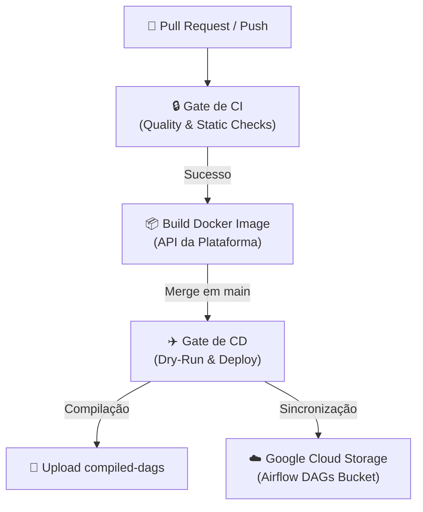

# Guia de CI/CD — Integração e Entrega Contínua

Este guia documenta o funcionamento e os estágios das pipelines de Integração Contínua (CI) e Entrega Contínua (CD) automatizadas via GitHub Actions.

---

## 1. Visão Geral do Fluxo

A automação da plataforma segue o fluxo estruturado de gates de qualidade até a entrega das DAGs e imagens nos ambientes correspondentes:



---

## 2. Integração Contínua (CI)

O workflow de CI é acionado a cada **Push** ou **Pull Request** direcionado às branches `main` e `develop`. Ele é composto pelo job `ci_gate` no arquivo [.github/workflows/ci_cd_pipeline.yml](file:///.github/workflows/ci_cd_pipeline.yml).

### Estágios do CI Gate

| Passo | Comando | Objetivo |
|---|---|---|
| **Ruff Format** | `uv run ruff format --check .` | Valida se o estilo de formatação do código segue as regras do PEP 8. |
| **Ruff Lint** | `uv run ruff check .` | Análise estática contra bugs, imports não utilizados e anti-padrões de clean code. |
| **Mypy Type Checking** | `uv run mypy app/` | Validação estática de tipos estritos para prevenir erros de runtime. |
| **YAML Validation Gate** | `uv run pytest tests/unit/infrastructure/test_ci_validator.py` | Garante que novos arquivos YAML declarados no diretório `dags/` sejam estruturalmente válidos. |
| **Testes de Unidade e Integração** | `uv run pytest -m "not e2e" -v --cov=app --cov-fail-under=80` | Executa a suite de testes locais (banco SQLite em memória). Exige no mínimo **80% de cobertura de código**. |

### Por que isolamos os testes E2E no CI?
Os testes E2E (`tests/e2e/`) exigem o cluster local Docker Compose completo (com Airflow, Postgres real e OpenBao) ativo. Para garantir velocidade de feedback e confiabilidade nos runners padrão do GitHub Actions, esses testes são marcados com `@pytest.mark.e2e` e **ignorados no CI padrão** usando a flag `-m "not e2e"`.

---

## 3. Entrega Contínua (CD)

O pipeline de CD é acionado automaticamente **apenas após o merge com sucesso** na branch `main`.

### Estágios do CD

#### 1. Validação de DAGs (Dry Run)
Antes de enviar qualquer arquivo Python para o ambiente de execução do Airflow, o CD roda os geradores de DAG em modo simulado (`dry-run`) para comparar diffs e garantir que nenhuma DAG inválida seja compilada:
```bash
uv run python -m cli.main pipeline rebuild --template-version 2.0 --dry-run
uv run pytest tests/unit/infrastructure/test_dag_generator.py -v
```

#### 2. Compilação e Geração das DAGs
Após a validação, a CLI do projeto reconstrói fisicamente as DAGs reais convertendo os templates Jinja2 e arquivos YAML configurados em código Python:
```bash
uv run python -m cli.main pipeline rebuild --template-version 2.0
```
As DAGs prontas são salvas no diretório `output_dags/` e armazenadas como artefato temporário do GitHub Actions (`compiled-dags`).

#### 3. Autenticação e Sincronização com Cloud Provider
O pipeline utiliza autenticação segura via Service Accounts para sincronizar os arquivos compilados da Landing/Analytics Zone:
- O diretório `output_dags/` contendo as DAGs geradas é sincronizado via `rsync` com o bucket de armazenamento de execução do Airflow (por exemplo, o bucket do Google Cloud Composer).
- A imagem docker da API construída no estágio anterior é tagueada e publicada no Registry (ex: Artifact Registry / ECR) para que a API da plataforma no Kubernetes (GKE) seja atualizada.

---

## 4. Como Executar Validações Locais Similares ao CI

Antes de abrir um Pull Request, execute os mesmos comandos localmente a partir da raiz do projeto para garantir aprovação imediata no CI:

```bash
# 1. Corrigir formatação automaticamente
uv run ruff format .

# 2. Corrigir lints e checar regras
uv run ruff check . --fix

# 3. Validar tipos estáticos
uv run mypy app/

# 4. Rodar testes locais com cobertura
.venv\Scripts\pytest -m "not e2e" -v --cov=app
```
