# Diagrama de Classes da Plataforma

Este documento apresenta o diagrama de classes da plataforma utilizando a especificação **Mermaid.js** (ideal para visualização nativa em leitores de Markdown, VS Code e GitHub).

O design segue rigorosamente os conceitos de **Arquitetura Limpa (Ports & Adapters)**, organizando as dependências de fora para dentro (a infraestrutura depende das portas da aplicação, e a aplicação depende das entidades do domínio).

```mermaid
classDiagram
    %% --- CAMADA DE DOMÍNIO ---
    namespace Domain {
        class Pipeline {
            +str id
            +str name
            +PipelineType type
            +EmailAddress owner
            +ScheduleConfig schedule
            +str source_asset_id
        }

        class PipelineRun {
            +str id
            +str pipeline_id
            +str pipeline_name
            +str pipeline_type
            +str dag_run_id
            +PipelineRunStatus status
            +datetime started_at
            +datetime finished_at
        }

        class DataAsset {
            +str id
            +str name
            +str description
            +AssetState state
            +str owner_email
        }

        class DataObject {
            +str id
            +str name
            +str asset_id
        }

        class Endpoint {
            +str id
            +str name
            +EndpointType type
            +str credential_ref
        }
    }

    %% --- CAMADA DE APLICAÇÃO (PORTS & USE CASES) ---
    namespace Application {
        class TelemetryPort {
            <<interface>>
            +record_metric(str name, float value, dict tags)*
            +record_event(str event_name, dict data)*
        }

        class OrchestratorPort {
            <<interface>>
            +trigger_dag(str pipeline_id, str run_id, str dag_run_id, str pipeline_name)*
        }

        class SecretManagerPort {
            <<interface>>
            +get_secret(str path)*
        }

        class UnitOfWork {
            <<interface>>
            +pipelines
            +pipeline_runs
            +objects
            +assets
            +endpoints
            +commit()*
            +rollback()*
        }

        class TriggerPipelineRunUseCase {
            -UnitOfWork uow
            -OrchestratorPort orchestrator
            -TelemetryPort telemetry
            +execute(str pipeline_id, str triggered_by) PipelineRun
        }

        class RegisterPipelineUseCase {
            -UnitOfWork uow
            +execute(...) Pipeline
        }
    }

    %% --- CAMADA DE INFRAESTRUTURA (ADAPTERS) ---
    namespace Infrastructure {
        class PrometheusMetricsAdapter {
            -CollectorRegistry registry
            -Histogram http_histogram
            -Counter pipeline_counter
            +record_metric(str name, float value, dict tags)
            +record_event(str event_name, dict data)
        }

        class AirflowOrchestratorAdapter {
            -str base_url
            -str username
            -str password
            +trigger_dag(...)
        }

        class BaoSecretManagerAdapter {
            -str client
            +get_secret(str path)
        }

        class SqlAlchemyUnitOfWork {
            -AsyncSession session
            +commit()
            +rollback()
        }
    }

    %% Relacionamentos de Dependência e Implementação
    PrometheusMetricsAdapter ..|> TelemetryPort : implementa
    AirflowOrchestratorAdapter ..|> OrchestratorPort : implementa
    BaoSecretManagerAdapter ..|> SecretManagerPort : implementa
    SqlAlchemyUnitOfWork ..|> UnitOfWork : implementa

    TriggerPipelineRunUseCase --> UnitOfWork : dependência
    TriggerPipelineRunUseCase --> OrchestratorPort : dependência
    TriggerPipelineRunUseCase --> TelemetryPort : dependência
    RegisterPipelineUseCase --> UnitOfWork : dependência

    TriggerPipelineRunUseCase ..> PipelineRun : cria / retorna
    RegisterPipelineUseCase ..> Pipeline : cria / retorna

    UnitOfWork --> Pipeline : gerencia
    UnitOfWork --> PipelineRun : gerencia
    UnitOfWork --> DataAsset : gerencia
    UnitOfWork --> DataObject : gerencia
    UnitOfWork --> Endpoint : gerencia
```

## Como Visualizar o Diagrama

1. **GitHub/GitLab**: O diagrama acima é renderizado automaticamente na interface web das plataformas de controle de versão.
2. **VS Code**: Instale a extensão **Markdown Preview Mermaid Support** ou abra este arquivo no Preview padrão do VS Code (`Ctrl+Shift+V`).
3. **Editor Online**: Você pode copiar a sintaxe do bloco acima e colar no [Mermaid Live Editor](https://mermaid.live) para exportar em SVG, PNG ou PDF.
