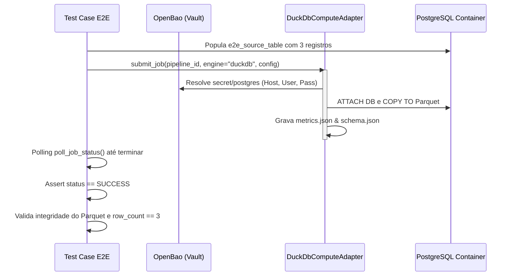

# Spec — Cenário E2E de Extração com DuckDB

Este documento especifica o design para o teste de ponta a ponta (E2E) integrado do `DuckDbComputeAdapter`. O teste valida toda a cadeia física de resolução de segredos, comunicação com PostgreSQL e persistência de arquivos Parquet.

---

## 1. Escopo e Objetivos

O objetivo deste teste é garantir que o motor DuckDB local consiga:
1. Conectar-se ao OpenBao (Vault) real do ambiente Docker Compose e extrair credenciais.
2. Iniciar a thread de background usando o executor de computação.
3. Conectar-se via Postgres Extension do DuckDB ao PostgreSQL real.
4. Ler os dados de uma tabela com dados de teste.
5. Gravar os dados extraídos em formato Parquet no diretório de saída temporário.
6. Gerar os metadados de estatísticas (`metrics.json`) e de contrato (`schema.json`).

---

## 2. Cenário de Teste: `test_duckdb_compute_adapter_e2e`

### Pré-condições
- O container do PostgreSQL deve estar rodando e conter a tabela `e2e_source_table`.
- O container do OpenBao deve estar rodando com as credenciais cadastradas na chave `secret/postgres`.

### Fluxo do Teste



### Detalhes das Asserções
- **Status de Execução:** Sucesso terminal.
- **Validação de Linhas (`metrics.json`):** `row_count` deve ser exatamente igual a 3.
- **Validação de Estrutura (`schema.json`):** Lista contendo as colunas `id` (tipo `INTEGER`), `name` (tipo `VARCHAR`) e `created_at` (tipo `TIMESTAMP`).
- **Existência de Arquivo:** O arquivo Parquet deve conter os 3 registros reais inseridos.

---

## 3. Estratégia de Verificação

Os testes de E2E rodam dentro do container do `e2e-tests` (ou do host). Este teste será incluído no arquivo `tests/e2e/test_platform_e2e.py` e marcado com `@pytest.mark.e2e`.

Para rodá-lo localmente:
```bash
docker compose run --rm e2e-tests pytest tests/e2e/ -k test_duckdb_compute_adapter_e2e -v
```
