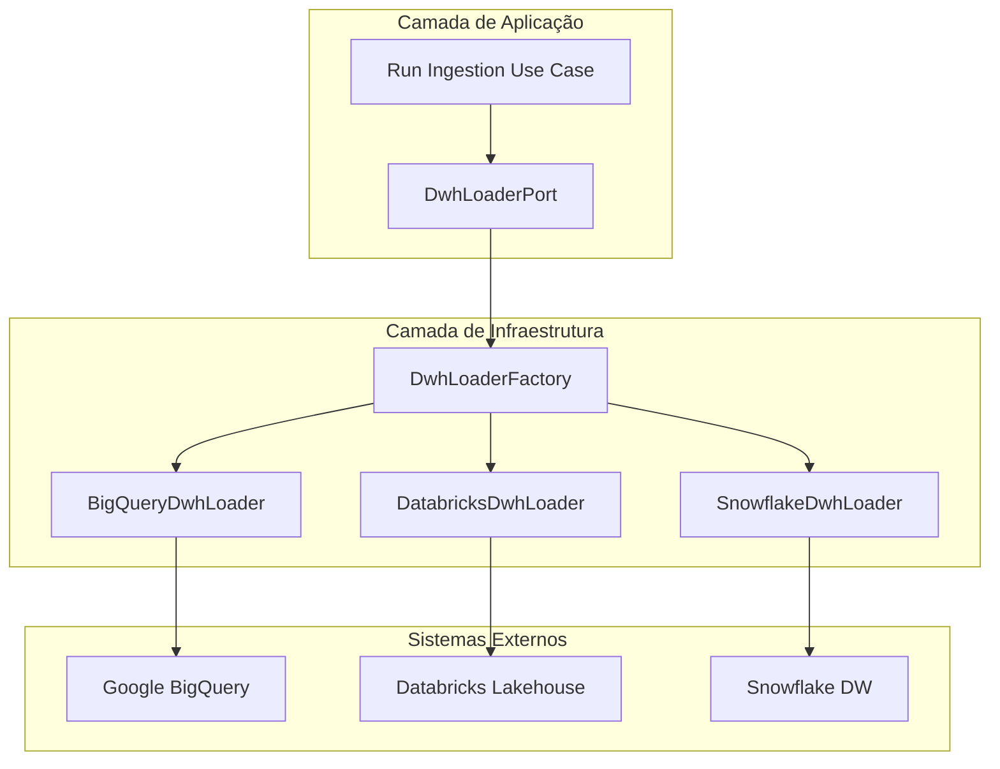

# Spec — Estratégia de Carregamento para Data Warehouse (DWH Loading)

Este documento especifica o design arquitetural para a etapa de carregamento de dados (DWH Loading) da plataforma. O objetivo é garantir que os arquivos estruturados gerados na etapa de computação (Parquet/Avro) sejam carregados nos bancos analíticos de destino de maneira desacoplada, segura e performática, suportando autenticação via IAM e segredos dinâmicos (Vault/OpenBao).

---

## 1. Escopo e Objetivos

O escopo desta especificação cobre:
1. Definição do protocolo de interface de carga (`DwhLoaderPort`) na camada de aplicação.
2. Implementação de adaptadores específicos de infraestrutura para os principais Data Warehouses (BigQuery, Databricks, Snowflake).
3. Estrutura de geração de metadados não-sensíveis para injeção na DAG durante a compilação (Compile-Time) e controle de autenticação flexível (IAM vs Vault) em execução (Runtime).
4. Lógica de validação pós-carga (`post_load_validation`) para garantir volume e integridade física de dados.

---

## 2. Visão Geral da Arquitetura (Clean Architecture)

Seguindo o design da plataforma, isolamos completamente o motor físico de carga do Apache Airflow utilizando **Ports & Adapters**:



---

## 3. Especificações Técnicas

### 3.1. Abstração do Carregador (`DwhLoaderPort`)
Definido como um protocolo Python puro na camada de aplicação (`app/application/pipelines/ports/dwh_loader.py`):

```python
from typing import Protocol, Any

class DwhLoaderPort(Protocol):
    """
    Porta de aplicação para integração física de carregamento com Data Warehouses.
    """
    def load(
        self,
        *,
        staging_path: str,
        schema_path: str,
        file_format: str,
        connection_metadata: dict[str, Any],
        resolved_credentials: dict[str, Any] | None = None
    ) -> dict[str, Any]:
        """
        Executa a carga em massa (bulk load) otimizada a partir de um staging bucket
        ou arquivo local para o Data Warehouse de destino.

        Retorna:
            dict contendo informações da carga executada (ex: {"rows_loaded": int, "checksum": str}).
        """
        ...
```

### 3.2. Mecanismo de Autenticação Híbrido (IAM vs Vault)
O carregamento de grandes volumes para DWH exige flexibilidade de segurança:
*   **Compile-Time (Geração da DAG):** A API da plataforma lê as configurações de conexão não-sensíveis (ex: Host do Databricks, Dataset do BigQuery, Nome da Tabela) e o `auth_method` do `Endpoint` de destino, gravando-os diretamente como parâmetros estruturados no arquivo Python da DAG.
*   **Runtime (Execução da Task):**
    -   Se `auth_method == "iam"`: O adaptador presume que o worker do Airflow tem uma role de IAM (AWS Instance Profile, GCP Workload Identity) associada e inicializa o SDK do DWH correspondente sem injetar tokens manuais.
    -   Se `auth_method == "vault"`: A task executa uma chamada efêmera à API da plataforma (`PlatformApiClient.resolve_vault_secrets`) para recuperar credenciais rotacionadas armazenadas no OpenBao antes de instanciar o SDK.

### 3.3. Fábrica de Carregadores (`dwh_loader_factory.py`)
Fábrica simples na infraestrutura para instanciar o loader correto baseado no tipo de banco configurado no endpoint:

```python
from app.application.pipelines.ports.dwh_loader import DwhLoaderPort
from app.infrastructure.dwh_loaders.bigquery_loader import BigQueryDwhLoader
from app.infrastructure.dwh_loaders.databricks_loader import DatabricksDwhLoader
from app.infrastructure.dwh_loaders.snowflake_loader import SnowflakeDwhLoader

def get_dwh_loader(engine_type: str) -> DwhLoaderPort:
    loaders = {
        "bigquery": BigQueryDwhLoader,
        "databricks": DatabricksDwhLoader,
        "snowflake": SnowflakeDwhLoader,
    }
    loader_cls = loaders.get(engine_type.lower())
    if not loader_cls:
        raise ValueError(f"DWH Loader engine não suportado: {engine_type}")
    return loader_cls()
```

---

## 4. Estratégias de Carregamento por Motor

Para evitar gargalos no worker do Airflow, os adaptadores usam comandos de carregamento em lote baseados em buckets de staging:

### 4.1. Google BigQuery Adapter (`BigQueryDwhLoader`)
Submete um Job assíncrono nativo no GCP para ingestão de arquivos direto do GCS:
*   **Mecanismo:** `google.cloud.bigquery.Client.load_table_from_uri`.
*   **Tolerância:** Configura `write_disposition` com base nas políticas de atualização da tabela (Append ou Truncate).

### 4.2. Databricks Adapter (`DatabricksDwhLoader`)
Dispara comandos SQL nativos via `databricks-sql-connector`:
*   **Mecanismo:** Comando SQL `COPY INTO <tabela> FROM '<staging_path>' FILEFORMAT = <format> FORMAT_OPTIONS ('mergeSchema' = 'true')`.
*   **Idempotência:** O Databricks rastreia automaticamente arquivos carregados para evitar duplicidade em retries.

### 4.3. Snowflake Adapter (`SnowflakeDwhLoader`)
Conecta e emite comandos SQL otimizados:
*   **Mecanismo:** Comando SQL `COPY INTO <tabela> FROM @<stage> FILE_FORMAT = (TYPE = <format>) PURGE = FALSE`.

---

## 5. Validação Pós-Carga (`post_load_validation`)

Logo após a task de carregamento ser finalizada, executamos uma task obrigatória de integridade de dados (`post_load_validation`) que:
1. Compara a contagem real de linhas importadas no DWH contra as estatísticas de escrita calculadas pelo DuckDB/Spark no arquivo `metrics.json`.
2. O pipeline falhará imediatamente se a variação de linhas for superior a `0.5%` (`delta_pct > 0.005`).
3. Compara o checksum das tabelas de origem e destino se fornecidos pela plataforma.

---

## 6. Estratégia de Teste (TDD)

1. **Testes Unitários:** Cada adaptador será testado isoladamente mockando os SDKs dos provedores de nuvem (ex: mockando a resposta de `load_table_from_uri` no BigQuery ou `cursor.execute` no Databricks).
2. **Testes E2E:** Um cenário de teste E2E local usando o Docker Compose validará a ingestão de uma tabela PostgreSQL simulando o DWH final através de um banco secundário de testes, garantindo que credenciais e dados fluam perfeitamente de ponta a ponta.
