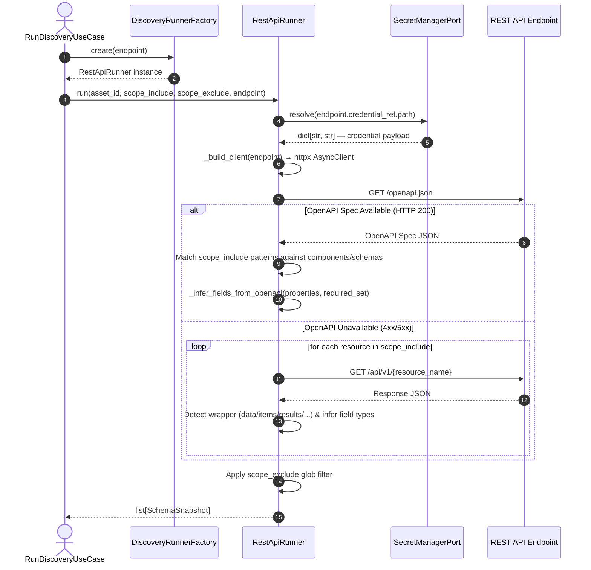

# REST API Discovery Service Design Specification

## Overview

The REST API Discovery Service provides dynamic metadata discovery, schema extraction, and schema drift detection for HTTP REST API endpoints within the Data Platform.
It enables the platform to automatically inspect external/internal REST APIs (such as `mock_store_api`), extract field definitions and canonical types, and construct immutable `SchemaSnapshot`s for pipeline generation and data asset registration.

This is **Subproject 1** of the API Ingestion & Export initiative.

---

## 1. Architecture & Component Design

### 1.1 Discovery Runner Implementation

A new runner `RestApiRunner` implements the `DiscoveryRunner` Protocol in `app/infrastructure/discovery/rest_api_runner.py`.

The `run()` signature **must exactly match** the `DiscoveryRunner` Protocol:

```python
class RestApiRunner:
    """
    Discovery runner for REST API endpoints.

    Supports hybrid discovery:
    1. Inspects OpenAPI/Swagger specification (GET /openapi.json) if available.
    2. Falls back to HTTP GET payload sampling per scope_include resource name.

    Auth credentials are resolved fresh per invocation from SecretManagerPort.
    """

    def __init__(
        self,
        secret_manager: SecretManagerPort,
        http_client: httpx.AsyncClient | None = None,
    ) -> None:
        self._secret_manager = secret_manager
        self._http_client = http_client or httpx.AsyncClient(timeout=10.0)

    async def run(
        self,
        asset_id: str,
        scope_include: list[str],
        scope_exclude: list[str],
        endpoint: Endpoint,
    ) -> list[SchemaSnapshot]:
        ...
```

**Key design decisions:**
- `credential_ref` is a `CredentialReference` value object — always use `endpoint.credential_ref.path` to resolve via `secret_manager.resolve(path)`.
- Auth headers are built fresh per invocation — tokens are never stored on the runner instance.
- `scope_include` patterns map to OpenAPI schema names or REST resource path segments.

### 1.2 Factory Registration

Update `DiscoveryRunnerFactoryImpl` (`app/infrastructure/discovery/discovery_runner_factory.py`) to instantiate `RestApiRunner` when the endpoint is a `RestApiEndpoint`:

```python
if isinstance(endpoint, RestApiEndpoint):
    from app.infrastructure.discovery.rest_api_runner import RestApiRunner
    return RestApiRunner(secret_manager=self._secret_manager)
```

---

## 2. Discovery Execution Flow



---

## 3. Data Mapping & Schema Construction

### 3.1 Type Normalization

All `normalized_type` values are **plain strings** consistent with the platform convention established in `MongoDbRunner` and `DatabaseRunner`:

| OpenAPI `type` + `format` | `source_type` | `normalized_type` |
|---|---|---|
| `integer` / `int32` | `openapi:integer(int32)` | `integer` |
| `integer` / `int64` | `openapi:integer(int64)` | `bigint` |
| `number` / `float` | `openapi:number(float)` | `float` |
| `number` / `double` | `openapi:number(double)` | `decimal` |
| `boolean` | `openapi:boolean` | `boolean` |
| `string` | `openapi:string` | `string` |
| `string` / `uuid` | `openapi:string(uuid)` | `string` |
| `string` / `date-time` | `openapi:string(date-time)` | `timestamp` |
| `string` / `date` | `openapi:string(date)` | `date` |
| `string` / `binary` | `openapi:string(binary)` | `bytes` |
| `array` or `object` | `openapi:array` / `openapi:object` | `json` |

For payload sampling (fallback), Python runtime types map to:

| Python type | `source_type` | `normalized_type` |
|---|---|---|
| `int` | `python:int` | `integer` |
| `float` | `python:float` | `float` |
| `bool` | `python:bool` | `boolean` |
| `str` | `python:str` | `string` |
| `dict` / `list` | `python:dict` / `python:list` | `json` |

### 3.2 SchemaField Construction

Fields are built using the canonical `SchemaField` dataclass from `app/domain/discovery/schema_field.py`:

```python
SchemaField(
    name=field_name,
    source_type="openapi:integer",      # raw type from endpoint
    normalized_type="integer",           # platform canonical string
    nullable=True,                       # False when in OpenAPI "required" list
    is_primary_key=True,                 # True for fields named "id" or flagged x-primary-key
    description="...",                   # from OpenAPI description if present
    extra={"resource": "Product", "discovery_method": "openapi"},
)
```

### 3.3 Primary Key Identification

- Fields named exactly `id` (case-insensitive) → `is_primary_key = True`.
- Fields with OpenAPI extension `x-primary-key: true` → `is_primary_key = True`.
- Fields ending in `_id` are **not** automatically marked as primary keys (they are foreign key candidates only).

### 3.4 SchemaSnapshot Construction

Snapshots use the canonical `SchemaSnapshot` dataclass from `app/domain/discovery/schema_snapshot.py`:

```python
SchemaSnapshot(
    object_id=asset_id,                          # ID of the DataAsset being scanned
    object_name=f"{base_url}/components/schemas/{schema_name}",  # OpenAPI
    # or: f"{base_url}/{resource_name}"         # payload sampling
    runner_type="rest_api",
    captured_at=datetime.now(UTC),
    row_count_estimate=None,                     # REST APIs rarely expose row counts
    fields=fields,
    extra={
        "discovery_method": "openapi",           # or "payload_sampling"
        "schema_name": schema_name,              # OpenAPI only
        "wrapper_key": None,                     # payload sampling: "data", "items", etc.
    },
)
```

---

## 4. Authentication

Supported `auth_type` values on `RestApiEndpoint`:

| `auth_type` | Secret payload key | HTTP header |
|---|---|---|
| `"bearer"` | `token` | `Authorization: Bearer <token>` |
| `"api_key"` | `token` | `x-api-key: <token>` |
| `"basic"` | `username`, `password` | `Authorization: Basic <base64(user:pass)>` |
| `""` (empty) | — | None (unauthenticated) |

Any other value raises `ValueError`. Credentials are never cached on the runner instance.

---

## 5. Error Handling

| Condition | Behaviour |
|---|---|
| `RestApiEndpoint.auth_type` is unsupported | Raise `ValueError` immediately |
| Non-`RestApiEndpoint` passed to `run()` | Raise `TypeError` with clear message |
| OpenAPI returns non-200 | Log at DEBUG, fall back to payload sampling |
| Payload sampling HTTP error | Log `WARNING`, skip that resource (no snapshot produced) |
| Secret not found in Vault | Propagate `KeyError` from `SecretManagerPort.resolve()` |

---

## 6. Wrapper Key Detection

REST APIs commonly wrap collection responses in an envelope object. The runner detects these standard keys (in order of priority):

`data` → `items` → `results` → `records` → `content`

If none of the above keys is present and the root response is a list, that list is used directly. If the root is a dict with none of the wrapper keys, the root dict itself is used as the single sample record.

---

## 7. Verification & Testing Strategy

- **Unit Tests (`tests/unit/infrastructure/discovery/test_rest_api_runner.py`)**:
  - Use `NoopSecretManagerAdapter` with a pre-loaded store dict for credential injection.
  - Mock HTTP responses via `respx`.
  - Cover: bearer / api_key / basic / unsupported auth; OpenAPI type mapping; wrapper unwrapping; `run()` with OpenAPI path; `run()` with sampling fallback; `TypeError` for wrong endpoint type.

- **Factory Tests (`tests/unit/infrastructure/discovery/test_discovery_runner_factory.py`)**:
  - Assert `RestApiEndpoint` now returns `RestApiRunner` (replace the existing `UnsupportedEndpointError` test).

- **E2E Test (`tests/e2e/test_rest_api_discovery_e2e.py`)**:
  - Module-marked with `pytestmark = pytest.mark.e2e` (module-level, not per-test decorator).
  - Uses `MOCK_API_HOST` env var (default: `localhost`) and port `8081`.
  - Validates real OpenAPI discovery against `mock_store_api`.
