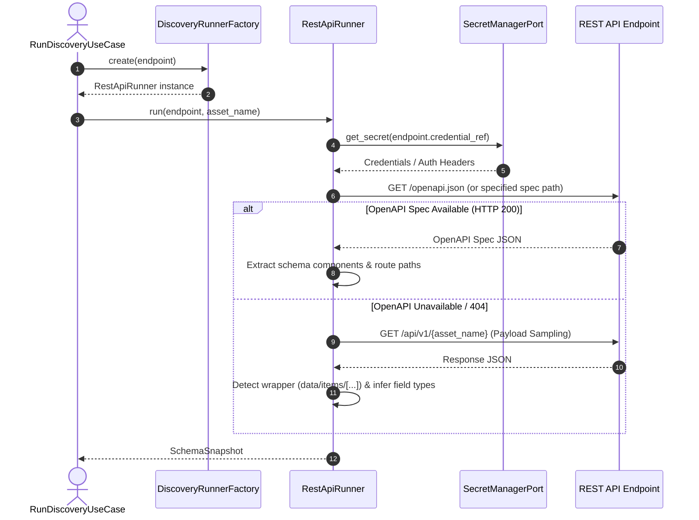

# REST API Discovery Service Design Specification

## Overview
The REST API Discovery Service provides dynamic metadata discovery, schema extraction, and schema drift detection for HTTP REST API endpoints within the Data Platform.
It enables the platform to automatically inspect external/internal REST APIs (such as `mock_store_api`), extract field definitions and canonical types, and construct immutable `SchemaSnapshot`s for pipeline generation and data asset registration.

This is **Subproject 1** of the API Ingestion & Export initiative.

---

## 1. Architecture & Component Design

### 1.1 Discovery Runner Implementation
A new runner `RestApiRunner` implements the `DiscoveryRunner` interface in `app/infrastructure/discovery/rest_api_runner.py`.

```python
class RestApiRunner(DiscoveryRunner):
    """
    Discovery runner for REST API endpoints.

    Supports hybrid discovery:
    1. Inspects OpenAPI/Swagger specification (e.g. /openapi.json) if available.
    2. Falls back to HTTP GET payload sampling if OpenAPI spec is missing or unavailable.
    """
    def __init__(self, secret_manager: SecretManagerPort, http_client: httpx.AsyncClient | None = None) -> None:
        self._secret_manager = secret_manager
        self._http_client = http_client or httpx.AsyncClient(timeout=10.0)

    async def run(self, endpoint: Endpoint, asset_name: str) -> SchemaSnapshot:
        ...
```

### 1.2 Factory Registration
Update `DiscoveryRunnerFactoryImpl` (`app/infrastructure/discovery/discovery_runner_factory.py`) to instantiate `RestApiRunner` when the endpoint is a `RestApiEndpoint`:

```python
if isinstance(endpoint, RestApiEndpoint):
    from app.infrastructure.discovery.rest_api_runner import RestApiRunner
    return RestApiRunner(secret_manager=self._secret_manager)
```

---

## 2. Discovery Execution Flow



---

## 3. Data Mapping & Schema Construction

### 3.1 Type Normalization
Raw OpenAPI and JSON data types map directly to the platform's canonical `ElementType`:

| OpenAPI / JSON Type | `source_type` | `normalized_type` (ElementType) |
|---|---|---|
| `"type": "string", "format": "date-time"` | `string(date-time)` | `TIMESTAMP` |
| `"type": "string", "format": "uuid"` | `string(uuid)` | `STRING` |
| `"type": "string", "format": "date"` | `string(date)` | `DATE` |
| `"type": "string"` | `string` | `STRING` |
| `"type": "integer"` | `integer` | `INTEGER` |
| `"type": "number"` | `number` | `DECIMAL` / `FLOAT` |
| `"type": "boolean"` | `boolean` | `BOOLEAN` |
| `"type": "array"` or `"type": "object"` | `array` / `object` | `JSON` |

### 3.2 Key & Metadata Mapping
- **Primary Key Identification**: Fields named `id`, ending in `_id`, or flagged with `x-primary-key: true` in OpenAPI schemas are assigned `is_primary_key = True`.
- **Field Metadata (`extra`)**: Route details (e.g. `endpoint_path`, `http_method`, `wrapper_key`) are saved inside `SchemaField.extra`.

---

## 4. Error Handling & Schema Drift

1. **HTTP Connection Failures**: Retries up to 3 times with exponential backoff on transient errors (`502`, `503`, `504`). Raises `EndpointConnectionError` if host is unreachable.
2. **Schema Drift Detection**: The generated `SchemaSnapshot` is automatically diffed against prior snapshots via `SchemaDiffer`. Additions, deletions, or type shifts trigger `DriftChangeEvent`s and enter the `DriftApproval` process.

---

## 5. Verification & Testing Strategy

- **Unit Tests (`tests/unit/infrastructure/discovery/test_rest_api_runner.py`)**:
  - Mock HTTP responses via `respx`.
  - Validate OpenAPI parsing logic and fallback JSON payload sampling.
  - Verify `ElementType` mapping rules.
- **Factory Tests (`tests/unit/infrastructure/discovery/test_discovery_runner_factory.py`)**:
  - Assert `RestApiEndpoint` returns `RestApiRunner`.
- **Integration/E2E Test (`tests/e2e/test_rest_api_discovery_e2e.py`)**:
  - Marked with `@pytest.mark.e2e`.
  - Executes real discovery against running `mock_store_api` service.
